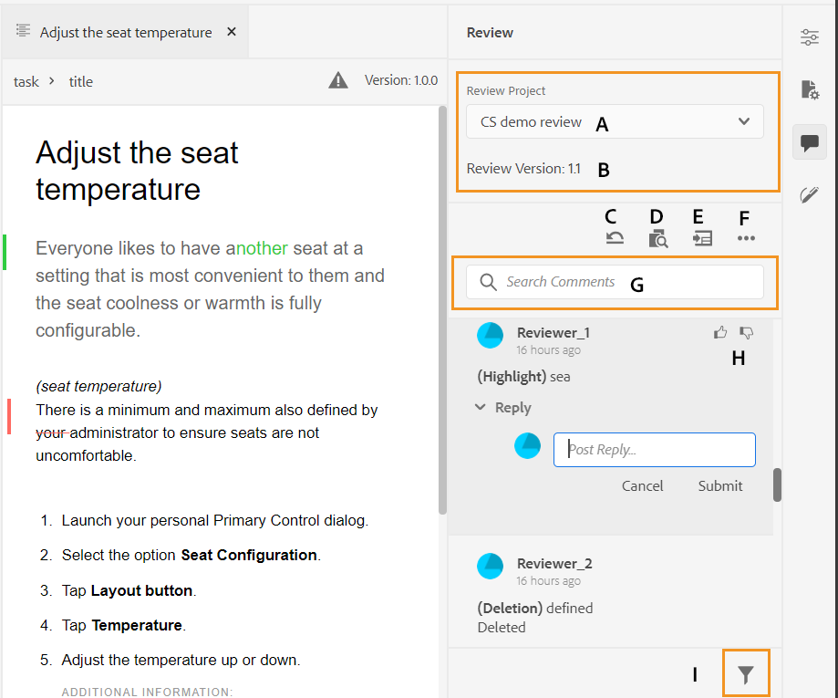
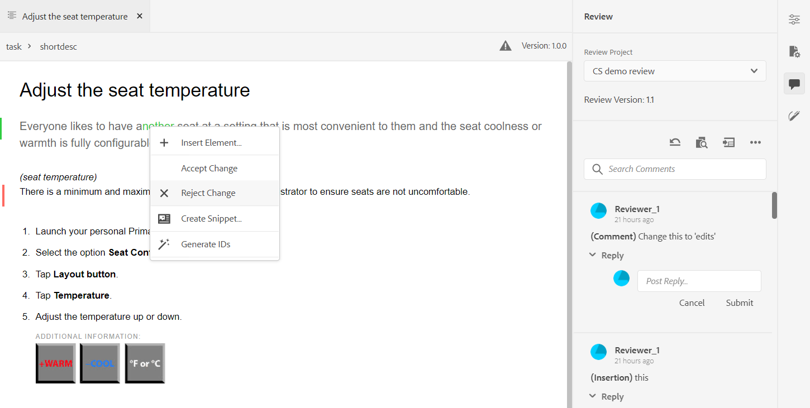
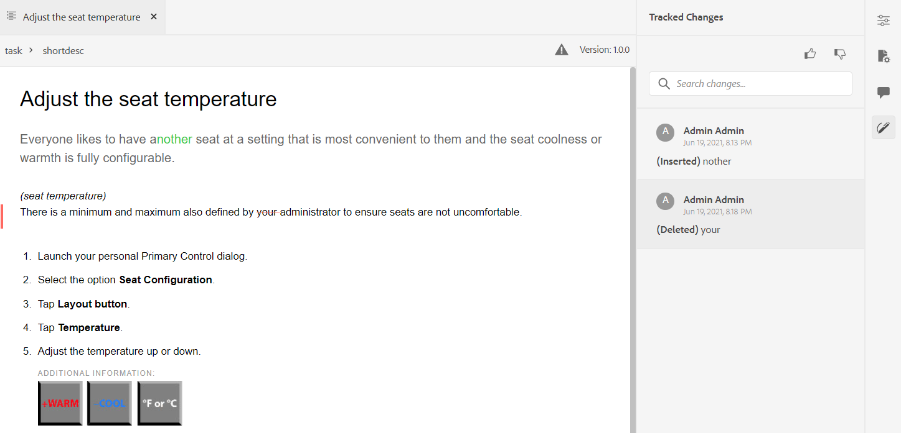

# 地址審閱注釋 {#id2056B0X0KBI}

作為作者，可以使用Web編輯器在主題中對注釋進行定址。 以下各節介紹在Web編輯器中編輯注釋的方法。

作者可以從Web編輯器處理文檔中的注釋。 提供了指示插入的注釋\(text\)、刪除還是突出顯示的可視指示器。 在每個注釋條目的頂部都提到了注釋類型。

>[!NOTE]
>
> 在處理審閱注釋\（對於活動審閱文檔\）時，請確保在啟用了完整標籤視圖的多個頁籤中不開啟正在審閱的主題，不要在「作者」和「源」視圖模式之間切換。

{width="650" align="left"}

在Web編輯器模式下，右面板包含「審閱」和「跟蹤的更改」表徵圖。 「審閱」面板顯示審閱人在文檔中所做的所有注釋。 「跟蹤的更改」面板顯示文檔中所有插入和刪除的注釋的狀態。

- **A**:選擇審閱項目以查看審閱注釋。 如果您的主題已在多個審閱任務中共用以供審閱，您將看到此下拉清單中列出的這些任務。

   從清單中選擇審閱任務後，您將看到審閱者在該任務中所作的注釋。 您可以在任務中獨立地處理審閱注釋，這意味著對注釋的任何更新都只對相應任務的審閱者可見。

- **B:** 每個 **審閱項目** 在文檔的特定版本上建立。 的 **審閱版本** 顯示與所選審閱項目關聯的版本。 這有助於您跟蹤已共用以供審閱的版本。

- **C**:如果在啟動審閱後更新了主題，則按一下「將主題還原為審閱版本」表徵圖會將工作副本還原為共用以供審閱的版本。 這樣，您就更容易將審閱反饋直接納入共用以供審閱的版本。 合併反饋後，您可以保存還原版本中的更改或建立主題的新修訂版本。 如果選擇建立主題的新修訂版，則會從共用以供審閱的主題版本建立新分支。 例如，如果共用版本 `1.2` 當前創作版本為 `1.3`，然後使用此表徵圖可切換回版本 `1.2` 納入審查意見。 如果在將更改合併到版本後選擇建立新版本 `1.2`，然後是帶有版本的新分支 `1.2.0` 為主題建立。

   通常，在合併審閱反饋後，您希望合併主題最新版本中的更改。 為此，請使用 [合併](web-editor-features.md#id205DF04E0HS) 功能，以獲取共用主題以進行審閱後進行的所有更新。

- **D**:開啟並排視圖以顯示主題的注釋版本。 如上面的螢幕抓圖所示，最左側的部分是主題的最新版本，您可以在其中進行更改。 下一節是主題的注釋版本。 在主題中的注釋之間導航時，側視圖會更改並顯示在其上做出注釋的主題的版本。 注釋面板中的每個注釋都連結到本節中的相應文本。 它可幫助您識別注釋的文本。 注釋按文檔中注釋文本的順序顯示。

   您可以在側視圖頂部看到版本號。 按一下此表徵圖將再次隱藏主題的已注釋版本。

- E:直接導入主題中插入和刪除的\（或刪除的\）注釋。 按一下「導入」表徵圖後，所有文本插入和刪除都顯示在主題的工作副本中。 現在，有兩種接受或拒絕評論的方法。

   如果要一次合併建議的更改\（插入或刪除\），只需按一下右鍵內容中的注釋，然後選擇接受更改或拒絕更改。 根據您的選擇，注釋被接受或拒絕。 如果接受了評論，則在內容中添加內容；如果被拒，則從內容中刪除。 此外，在「審閱」面板中更改注釋的狀態。

   {width="800" align="left"}

   也可以使用右側面板中的審閱功能接受或拒絕注釋。 按一下任何注釋會突出顯示文檔中的注釋。

   {width="800" align="left"}

   >[!IMPORTANT]
   >
   > 導入注釋功能只適用於那些自共用以供審閱後未更改的文檔。 如果在發送文檔以供審閱後進行了任何更改，您將收到警報 **強制導入** 注釋到文檔中。 但是，這樣做將導致丟失您在文檔中所做的所有更新。 的 **強制導入** 如果在外部建立文檔，然後共用以供審閱，則會顯示警報。 您可以繼續並導入注釋。

   在您接受或拒絕注釋時，它將從「跟蹤的更改」清單中刪除。 這也是檔案中需要處理多少評論的指標。

- **F**:從「更多選項」菜單，下載審閱主題中可用的所有附件。
- **G**:在注釋中搜索文本。
- **H**:接受或拒絕注釋。

- **我**:對注釋應用篩選器。 您可以根據審閱類型\（全部、突出顯示、刪除、插入或粘滯附註\）、審閱狀態\（全部、接受、拒絕或無\）、審閱者\(全部或特定審閱者\(s\)\)或主題版本來篩選查看注釋。

**父主題：**[&#x200B;查看主題或地圖](review.md)
