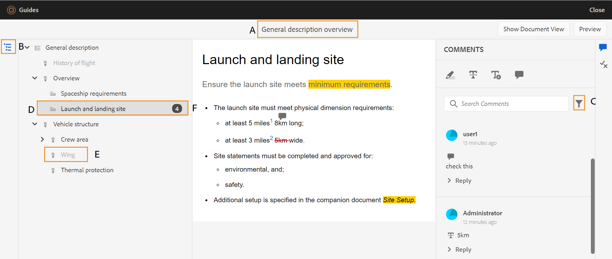
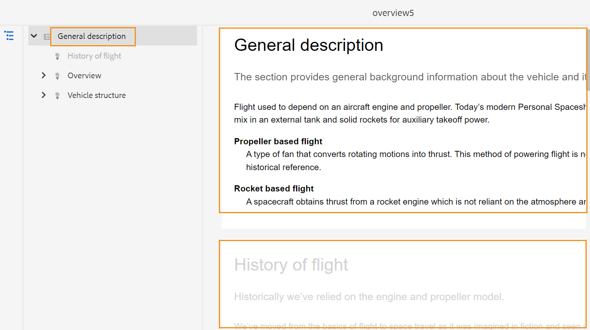
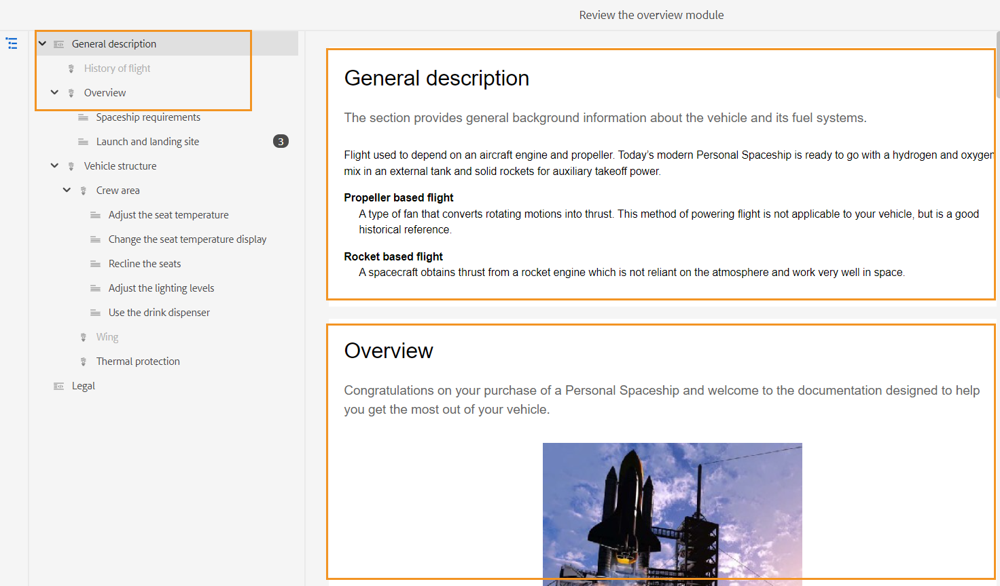
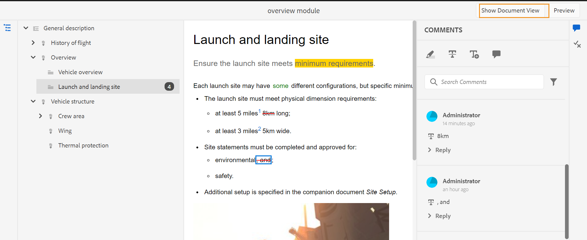

# 檢閱主題 {#id2056B0W0FBI}

如果您是審核者，您會收到一封包含審核主題連結的審核請求電子郵件。 按一下連結即可前往檢閱頁面，您可以在其中針對共用主題新增意見。

執行下列步驟以檢閱主題：

1. 按一下檢閱請求電子郵件中提供的直接連結。

   主題或地圖連結在瀏覽器中開啟。

   >[!NOTE]
   >
   > 您也可以從AEM使用者介面的收件匣通知區域存取主題檢閱連結。

1. 根據主題審閱的啟動方式，您可以看到以下兩個螢幕中的任何一個：

   >[!NOTE]
   >
   > 如果您已在中建立審核，則UI可能會不同：
   >
   > - AEMas a Cloud Service指南2022年11月或更舊版本
   > - AEM指南4.1版或更舊版本

   當使用DITA映射啟動審核工作流時，將顯示以下螢幕：

   {width="800" align="left"}

   此畫面提供下列選項：

   - **A**:審核任務的名稱。
   - **B**:按一下「主題視圖」表徵圖以顯示或隱藏主題面板。

   - **C**:突出顯示的數字 ***F*** 可從此處選擇所需的篩選選項來篩選。 您可以依注釋的類型、狀態、審閱者或版本來篩選注釋。 例如，如果您想查看每個正在審閱的主題中已做出多少個刪除注釋，請按一下篩選表徵圖，然後選擇 **檢閱類型** \> **刪除**.

      >[!NOTE]
      >
      > 套用篩選時，只有符合所選篩選的註解才會顯示在「註解」面板中。 篩選的留言數會顯示在「主題」面板的左側。

   - **D**:指派給目前審核者的主題以黑色顯示，且可點按。 審核者點按主題連結時，該主題會帶到螢幕頂部。
   - **E**:無法供檢閱的主題會反灰。 該主題以只讀模式顯示，您不能為此類主題添加任何審核注釋。

   - **F**:收到的主題評論數。 此數字會根據您套用的篩選器而變更。

   地圖中的所有主題都以單個複合文檔的形式顯示。 允許審核者查看的主題正常顯示。 不會顯示不允許審閱的主題。

   {width="800" align="left"}

   在上面的螢幕截圖中，共用「一般說明」主題以查看當前審閱者，該主題正常顯示。 不過，下一個主題「飛行記錄」內容不會共用以供審核，而會以唯讀模式顯示。 目前正在關注的主題也在目錄中突出顯示。

   選取並共用主題或多個主題以供檢閱時，會顯示下列畫面：

   {width="800" align="left"}

   >[!NOTE]
   >
   > 如果有多個主題，則它們在文檔視圖中顯示為一個複合文檔。 上述螢幕擷取畫面會以單一檢視呈現兩個不同的主題。

1. 按一下 **註解** 圖示。

   從工具列中選取適當的註解類型，然後按Enter以提交您的註解，以提供審核註解。

   >[!NOTE]
   >
   > 「留言」面板只會顯示對目前主題所提供的留言。 將焦點移至其他主題時，會顯示對其他主題所提供的意見。

1. 按一下 **關閉** 按鈕。 按一下 **關閉** 按鈕時，系統會將您重新導向至您存取檢閱主題的頁面。

## 審核螢幕上提供的附加功能

**文檔視圖和主題視圖**  — 預設情況下，如果共用多個主題供審閱，則向審閱者顯示主題的複合文檔視圖。 如果是DITA地圖審核，則映射中的所有主題都以單個文檔的形式呈現，類似於書面視圖。 您也可以按一下特定主題，然後只會在檢閱畫面上顯示該主題。

查看單個主題時，您將獲得一個附加選項，以切換回文檔視圖。 在以下螢幕截圖中，將開啟映射檔案中的特定主題供查看。 突出顯示的選項 —  **顯示文檔視圖** 允許用戶切換回映射檔案的文檔視圖。

{width="800" align="left"}

**使用不同類型的注釋工具**  — 您可以通過突出顯示文本、突出文本、插入文本或添加註釋注釋來添加行內注釋。 「注釋」工具欄中提供的不同類型的注釋工具如下所述：

{width="350" align="left"}

- **反白顯示** \(\):要添加突出顯示注釋，請選擇文本並按一下「突出顯示」表徵圖。 或者，按一下「反白標示」圖示並選取所需文字：

   {width="650" align="left"}

   「注釋」面板中會出現快顯視窗，您可以在其中為醒目提示的內容新增注釋。

- **三振** \(\):如果您想要建議移除內容，可以選取內容並按一下「刪除」圖示來移除。 或者，選取所需的文字，然後按一下「刪除」索引鍵：

   「注釋」面板中會出現快顯視窗，您可以在其中為已刪除的內容新增注釋。

- **插入文字** \(\):如果要插入文本，請按一下「插入文本」表徵圖，並將游標置於要插入文本的位置，並在資訊中鍵入。 或者，將游標置於要插入文本的位置並開始鍵入。 新增的資訊會以綠色字型顯示：

- **添加註釋**\(\):如果要新增註解類型的註解，請按一下「新增註解」圖示，然後在快顯視窗中輸入註解。

**內容工具列**

您也可以使用內容工具列快速反白標示或刪除文字。 使用內容工具列執行下列步驟來註解：

1. 選取要突出顯示或穿透的文本。 內容工具列隨即出現。

   {width="550" align="left"}

1. 按一下 **反白顯示**&#x200B;或 **三振** 表徵圖。
1. 您可以在註解面板中為醒目提示或字串動作新增註解。

**使用「注釋」面板檢閱** - 「注釋」面板顯示針對當前主題提供的注釋清單。 如果主題已發送給多個審閱者，此面板還會列出其他審閱者的注釋。 註解面板中的每個註解都連結至目前主題中的對應文字。 可協助您識別留言的文字。 每則留言會顯示已新增留言的審核者名稱以及時間戳記。

注釋按文檔中注釋文本的順序顯示。 例如，第一句上有突出顯示注釋，第一段中第二句上有插入文本注釋，然後突出顯示文本注釋顯示在插入的文本注釋之前。

使用「注釋」面板可以執行的任務如下：

- 按一下注釋將突出顯示並顯示文檔中相應注釋的位置。
- 您可以新增回覆至留言。
- 在「注釋」面板中按一下您的注釋文本，然後選擇 **編輯** ，從「選項」菜單。
- 您可以按一下「注釋」面板中的注釋，然後選取 **刪除** 選項。

   {width="300" align="left"}

   >[!NOTE]
   >
   > 「選項」功能表僅會在您將游標移至自己的留言時顯示。 其他審閱者不會顯示該注釋。

- 所有參與的使用者都可以回應其他使用者提交的意見。 在注釋上，按一下 **回覆** 然後按Enter鍵提交響應。

**預覽模式**

- 在「預覽」模式中開啟主題時，會顯示在套用所有變更後，作者檢視主題時主題的顯示方式。 例如，所有插入的文字都顯示為一般文字，而所有去除的\（已刪除\）文字都會從內容中移除。

- 以下螢幕擷圖顯示 *檢閱* 模式：

{width="550" align="left"}

以下螢幕擷圖顯示 *預覽* 模式：

{width="550" align="left"}

**向注釋添加附件**  — 如果要通過提供其他資訊來補充注釋，而其他檔案中提供了這些資訊，則可以通過附加註釋來補充注釋。 作為審閱者，您可以輕鬆地將一個或多個檔案從本地系統添加到注釋中。 可將檔案新增至所有支援的注釋形式 — 反白顯示、刪除、插入文字或注釋。

插入任何注釋時，將出現注釋彈出窗口。 在快顯視窗中提供其他意見或資訊後，按Enter即可提交。 新增留言後，您就可以選擇將附件新增至該留言。

{width="800" align="left"}

在上面的螢幕截圖中，文檔包含突出顯示的注釋的彈出窗口，注釋也將添加到「注釋」面板中。 檔案附件表徵圖 可在這兩個位置取得，並搭配註解。

執行下列步驟將附件添加到注釋中：

1. 按一下 *添加附件* 圖示  在要新增附件的註解上。

   出現「檔案開啟」(Open)對話框。

1. 選擇要附加的一個或多個檔案。

   所選檔案與注釋一起顯示在「注釋」面板中。

   在「注釋」面板中，您可以看到檔案名稱及其大小。 您也可以選擇按一下刪除圖示來移除檔案  與檔案名關聯。

1. 按一下 **提交**.

   附件會上傳並新增至註解。

**有關使用附件的其他說明：**

- 預設情況下，只顯示附有注釋的兩個檔案。 如果有更多檔案，則 **查看附件** 右側的按鈕顯示與注釋關聯的所有附件\（多於兩個\）的數量。 您可以按一下編號以檢視所有附件。 例如，如果您有四個附件，其中含有註解，則會在按鈕上看到+2。

{width="550" align="left"}

- 將滑鼠指針懸停在附件上可提供下載或刪除附件的選項。 只有當當前審閱者添加了該注釋時，才能刪除附件，如下螢幕截圖所示：

{width="550" align="left"}

其他審核者或作者只會取得下載附件選項。

{width="550" align="left"}

- 您可以從下載與注釋關聯的所有附件 **查看附件** 對話框。 選取附件，然後按一下 **下載** 表徵圖。

- 您也可以從 **查看附件** 對話框。 選取附件，然後按一下 **刪除** 表徵圖。

{width="550" align="left"}

**條件面板**  — 如果您的主題有條件式內容，您會看到 **條件** \(\)圖示。 按一下 **條件** 圖示會開啟「條件」面板，讓您根據主題中的可用條件反白標示內容。

:依預設 **反白顯示所有條件** 選項啟用，會選取所有條件，並顯示整個內容，而條件化內容在檢閱和預覽模式中都會以醒目提示顯示。

:您可以停用 **反白顯示所有條件** 選項，並將主題中呈現的所有內容顯示為普通文本，而不顯示任何突出顯示。

{width="350" align="left"}

您可以選擇隱藏或顯示特定條件。

- 如果隱藏條件，則在審閱模式中不會突出顯示具有該條件的內容。
- 如果您顯示條件條件化內容，則會在檢閱模式中反白顯示。 例如，在以下螢幕擷取中，只有內容使用兩個條件： `win` 和 `mac` 會加亮顯示。

{width="650" align="left"}

在預覽模式中，非條件化內容和使用兩個顯示條件的條件 —  `win` 和 `mac` 的下界。 隱藏條件的其餘條件化內容不會顯示。

**即時審核**  — 「評論」面板會即時更新評論，以及作者對評論所採取的意見或行動。

- 多名審閱者將能夠在同一份檔案上同時留下評論或回複評論。 通過將滑鼠懸停在螢幕右上角的用戶表徵圖上，可以查找當前正在查看文檔的用戶。

- 如果主題是多個審閱任務的一部分，則在一個任務中發表的注釋不會顯示在另一個任務中。

- 按一下「過期注釋」表徵圖\(\)顯示文檔的最新版本和備注版本之間的差異。 版本編號\（要比較的版本編號\）顯示在文檔的頂部。

   {width="800" align="left"}

   >[!NOTE]
   >
   > 當您將游標暫留在「過期的留言」圖示上時，系統會顯示已新增留言之主題的版本號碼。 例如，如果在1.0版上提供了注釋，則會顯示相同的注釋。

- 按一下過期的留言會在左側面板中開啟該留言的版本。 舊版會顯示在左側面板，而目前的版本會顯示在右側面板。 過期版本上的所有注釋都會匯入到左側。 您可以比較舊版與目前版本。

**篩選注釋**  — 您可以篩選文檔中的注釋，以根據需要查看特定注釋。 若要篩選留言，請按一下 **篩選** 表徵圖\(\)，顯示在「注釋」面板的「搜尋注釋」文字方塊右側的功能表中。

從 **篩選類型** 對話方塊，按一下 **套用**.

- **檢閱類型**  — 根據注釋類型篩選 — 突出顯示、刪除、插入或注釋。
- **審核狀態**  — 根據注釋的狀態進行篩選，如「已接受」、「已拒絕」或「無」。
- **審核者**  — 根據審閱者的名稱進行篩選。

- **版本**  — 根據收到的關於某一主題版本的評論進行篩選。

   使用篩選時，會根據選取項目篩選右面板的註解，並據此更新左面板的註解數。

若要移除篩選並檢視所有註解，請取消選取 **篩選類型** 對話方塊，按一下 **套用**.

**上層主題：**[&#x200B;查看主題或地圖](review.md)
