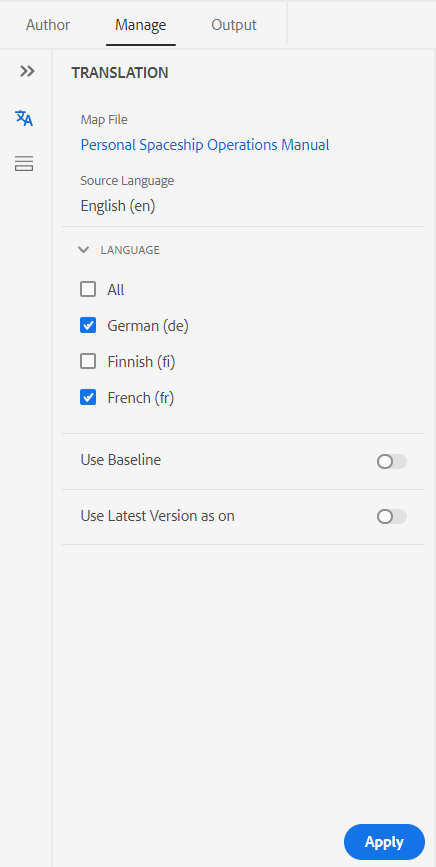
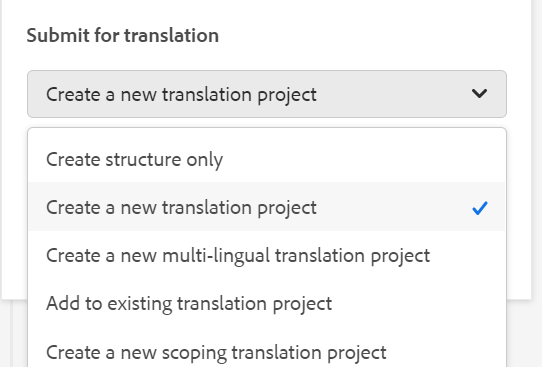

# 從Web編輯器翻譯文檔 {#id21BKF0Z0YZF}

>[!TIP]
>
> 如果您已as a Cloud Service於2022年2月或更新版本升級至AEM指南，建議使用網頁編輯器的此翻譯功能。

AEM指南隨附網頁編輯器中的強大功能，可讓您將內容翻譯成多種語言。 您可以建立新的翻譯專案，之後再將翻譯工作新增至現有的翻譯專案。 您也可以建立多語言翻譯專案，其中包含所有所選語言的翻譯工作。

>[!NOTE]
>
> 管理員可以在Web編輯器中配置「管理」頁簽\（用於翻譯\）。 如需詳細資訊，請參閱 *在網頁編輯器中設定翻譯功能* 一節中的「安裝及設定Adobe Experience Manager指南」as a Cloud Service。

## 開始之前

在執行此程式中的步驟之前，請確定您已建立所需的語言根和目標資料夾

1. 建立根資料夾以儲存您的來源內容。 根資料夾必須使用語言名稱\（如英文\）或語言代碼\(en\)建立。
1. 建立您要翻譯內容的目的地資料夾。 例如，如果要將內容翻譯成德文或法文，則必須建立名為 — de \（德文\）或 — fr \（法文\）的資料夾。

>[!NOTE]
>
> 根資料夾和目標資料夾必須在相同層級建立。

## 建立翻譯專案

1. 在「儲存庫」面板中，在映射視圖中開啟DITA映射檔案。
1. 按一下 **管理** 標籤。 翻譯面板會顯示DITA映射的超連結標題，以及 **語言** 清單。
1. 從 **語言** 清單中，選擇要將項目翻譯到的地區。 您可以選取 **全部** 將您的專案翻譯成所有可用語言。

   >[!NOTE]
   >
   > 清單包含語言資料夾及其語言代碼。 例如，法文\(fr\)和德文\(de\)。

   >[!IMPORTANT]
   >
   > 語言只顯示與源語言並行建立語言資料夾的語言。 也不會顯示在任何其他級別建立的語言資料夾，例如從源語言資料夾向下的一個級別。 確保在與源語言資料夾相同的級別建立所有目標語言資料夾。

   {width="350" align="left"}

1. 您也可以使用下列選項：

   **使用基線：** 您可以選取基線來轉換您的專案。 按一下「使用基線」(Use Baseline)，然後選擇在映射上建立的基線。 所有屬於所選基線的檔案都顯示在「翻譯」頁中。 翻譯內容後，即可匯出翻譯的基線。 如需匯出已轉譯基線的詳細資訊，請參閱 [導出轉換的基線](generate-output-use-baseline-for-publishing.md#id196SE600GHS).

   **使用最新版本為**:選擇以根據主題的建立日期和時間篩選主題的版本。 如果選擇日期和時間，則只顯示在所選日期和時間或之前建立的檔案的最新版本。

1. 按一下 **套用**. 畫面上會顯示主題和相關資產的詳細資訊清單。
1. 選取要傳送以供翻譯的主題。

   您也可以使用下列主題篩選選項：

   - **標題**:源檔案的標題
   - **檔案名**:源檔案的名稱
   - **檔案類型**:源檔案的類型。 可用選項有「對應」、「主題」和「影像」。
   - **參考類型**:直接或間接參考
   - **版本**:源檔案的版本號
   - **版本標籤**:源檔案的選定版本的標籤
   - **目標版本**:目標檔案的版本號
   - **檔案狀態**:源檔案的狀態。 可用的選項有草稿、審核中和審核。
   - **目標語言**:要翻譯源檔案的語言
   - **翻譯狀態**:可用選項包括：不同步、缺少副本、正在進行和同步。
   - **目標標籤**:目標檔案的選定版本的標籤
1. 按一下 **傳送以進行翻譯** 在右上角。

   {width="800" align="left"}

1. 從下拉式清單中，選取 **建立新的翻譯專案**.

   {width="350" align="left"}

   除了新的翻譯專案，您也可以從下列選項中選取：

   - 您可以選擇 **建立結構** 僅用於翻譯專案。
   - 您可以選取 **建立新的多語言翻譯專案** 其中包括您為翻譯選擇的所有語言的翻譯工作。 例如，如果您已選取法文、德文和西班牙文，則會建立一個項目，其中包含所有三種語言的翻譯工作。
   - 如果您已有翻譯專案，則可將主題新增至該專案。 選擇添加到 **現有翻譯專案** 選項，然後從「現有翻譯項目」清單中選擇項目。 您可以依最近、遞增或遞減順序來排序這些專案。

      >[!NOTE]
      >
      > 如果現有專案是範圍分析專案，其名稱會附加「\（範圍分析\）」。

   - 如果需要建立要翻譯的項目的範圍，可以選擇 **建立新的範圍轉換專案**. 這不會傳送要翻譯的復本，而且會保留檔案的原始翻譯狀態。 發送以進行範圍界定的引用主題的目標語言副本不受影響。
1. 在「專 **案標題** 」欄位中，輸入專案標題。
1. 按一下 **建立** 建立新翻譯專案。

   系統會使用所選主題版本建立新的翻譯專案。 此時會顯示快顯訊息，確認已建立翻譯專案。 翻譯專案中提供所有目標語言副本後，您就會在收件匣中收到通知。 翻譯專案中提供目標語言副本後，您就可以開始翻譯工作。 如需詳細資訊，請參閱 [開始翻譯工作](translation-first-time.md#id225IK030OE8).

   >[!NOTE]
   >
   > 如果您拒絕翻譯工作中一個或多個主題的翻譯，則 **進行中** 所有已拒絕主題的翻譯狀態都回復為原始狀態。 根據最新的翻譯狀態檢查並還原所引用主題的狀態。 此外，即使目標項目中的翻譯被拒絕，也不會刪除在目標項目中建立的翻譯檔案。

## 將版本標籤傳遞至目標版本

AEM指南可讓您將來源檔案的標籤傳遞至目標檔案。 這有助於您輕鬆識別翻譯檔案的來源版本。

要在目標副本中添加源版本標籤，系統管理員必須選擇該選項 **將源版本標籤傳播到目標版本** 在 **翻譯** 標籤 **編輯器設定**.

例如，如果您有某些來源檔案具有版本標籤 `Release 1.0` 套用至這些標籤，則您也可以傳遞來源標籤\(`Release 1.0`\)轉譯為檔案。

{width="650" align="left"}

>[!NOTE]
>
> 源標籤僅附加到一個目標版本。 如果將源標籤移動到其他版本，則源標籤會自動反映在最新的目標標籤中。

## 查看不同步檔案的版本差異 

AEM指南提供檢查所選版本與上次翻譯的主題源版本之間差異的功能。 您可以選擇翻譯 **不同步** 檔案。

{width="800" align="left"}

選取 **顯示差異**&#x200B;表徵圖\(\)，以查看上次翻譯版本與目前版本所選檔案之間的差異。

>[!NOTE]
>
> **顯示差異** 表徵圖\(\)只會針對轉換狀態為 **不同步**.

此 **版本差異** 對話框。 它會顯示 **上次翻譯的版本** 和 **所選版本** 左邊的數字。 預覽窗口顯示上次翻譯版本與主題選定版本之間的差異。

{width="650" align="left"}

## 解除不同步的資產

如果您對某些資產進行變更，這些資產就會變為不同步。 您可以重新轉譯已修改的資產，或選擇關閉「不同步」狀態。 例如，如果您做了一些非常微小的更改，這些更改實際上不需要翻譯，則可以將其狀態標籤為「同步中」。

要關閉「Out of Sync（不同步）」狀態，請執行以下步驟：

1. 選取您要變更狀態的不同步資產。
1. 選取 **標籤同步** 按鈕\(\)。 此 **標籤同步** 對話框。

   {width="550" align="left"}

1. 按一下 **強制同步**. 它會為選取的「不同步」資產將狀態設為「同步中」。

>[!NOTE]
>
> **標籤同步** 按鈕\(\)只會針對翻譯狀態為「不同步」的資產顯示。

## 查看正在進行的映射或主題轉換項目

您的翻譯控制面板上的某些參考可能正在進行中。 這些參考具有 **進行中** 連結 **翻譯狀態** 欄。 按一下連結時， **進行中項目** 對話框開啟。 在對話方塊中，您可以看到包含所選參照的所有正在進行翻譯專案\（連同目標語言\）清單。

>[!NOTE]
>
> 您可以看到在2023年2月或更新版本的AEM指南中建立之翻譯專案的「進行中」連結。

在對話框中按一下參照的名稱，以在預覽模式中開啟它。 您也可以按一下翻譯專案以開始翻譯。

{width="550" align="left"}

**上層主題：**[&#x200B;使用Web編輯器](web-editor.md)
