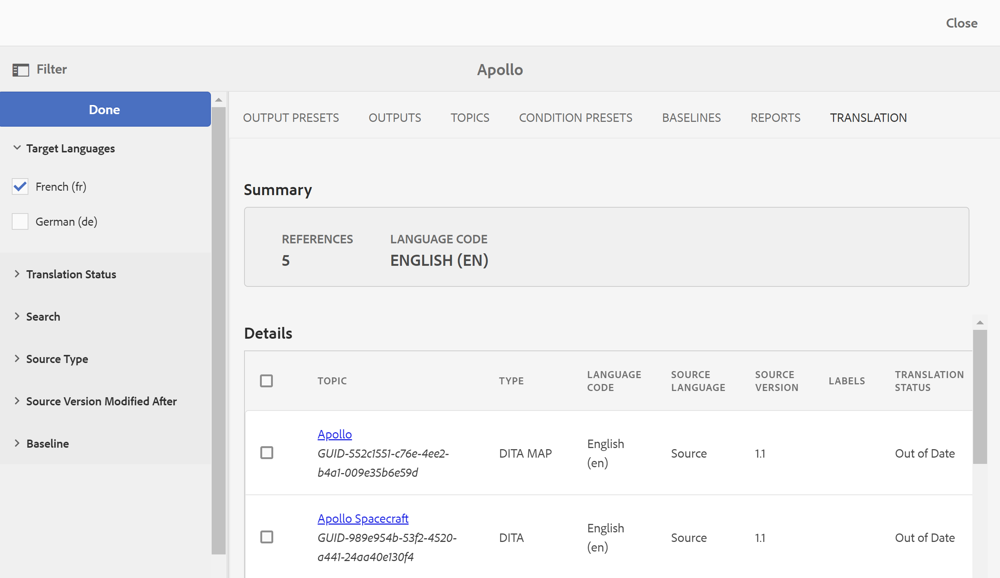

# 內容翻譯的最佳實務 {#id1678G0S702F}

翻譯內容時請考量下列幾點：

- 資料夾和檔案名稱必須符合檔案命名標準，例如 — 不應有空格、單引號、大括弧、等號、特殊或非ASCII字元。

- 如果您翻譯不同語言的內容，則必須建立與每種語言對應的資料夾。 每個語言資料夾都會包含對應於該語言的內容。 例如，您可以使用語言指示項建立資料夾，例如 `de` 若為德文， `fr` 法文版，等等。 或者，您也可以使用語言和區域指示項來建立資料夾，例如 `fr-FR` 法文版的URL或 `fr-CA` 適用於加拿大使用的法文。
- 目標語言也應根據其執行個體上的目標語言資料夾選取實際地區設定。
- 雲端設定應與來源資料夾的雲端設定相同，且一個資料夾中應只有一個雲端設定。 如果要使用多個翻譯聯結器，您可以在/conf下建立多個資料夾。
- 資料夾中的檔案不應超過1000個。
- 確保負責啟動翻譯流程的使用者擁有來源和目標語言資料夾的讀取、修改、建立和刪除許可權。
- 由於翻譯內容需要建立翻譯專案，因此使用者必須有權在AEM中建立專案。
- 如果您想要將條件預設集與地圖搭配使用，必須先建立它們，才能起始翻譯程式。 由於條件預設集也隨附在地圖翻譯版本中，因此在啟動翻譯流程之前建立預設集可確保它們在翻譯版本中可用。
- 內容翻譯程式必須從DITA map主控台(而非AEM Assets UI)啟動。
- 如果您透過人工翻譯來翻譯內容，則不得使用元件式DITA翻譯工作流程。 不過，此選項必須用於機器翻譯。
- 全球使用的內容與媒體若不需要本地化，應保留在語言副本之外。
- 所有必須本地化的常見內容，都應放在語言資料夾下的常見資料夾中。

下圖顯示當您有全域使用的內容和三個語言副本時，AEM中的資料夾結構範例。

{width="800" align="left"}

## 設定翻譯服務

執行以下步驟來設定要使用的人工或機器翻譯服務：

1. 在「資產」UI中，選取來源語言資料夾。

1. 開啟資料夾屬性，然後前往 **Cloud Services** 標籤。

1. 在 **Cloud Services** 索引標籤中，設定您要使用的翻譯服務。

   您可以設定機器翻譯或人工翻譯。

   確保一個資料夾中只有一個轉譯聯結器的設定。 如果有多個翻譯聯結器，可在/conf下建立多個資料夾。 在開始翻譯程式之前，來源語言資料夾必須選取雲端設定。

   >[!NOTE]
   >
   > 另請參閱 [設定翻譯整合架構](https://experienceleague.adobe.com/docs/experience-manager-cloud-service/sites/administering/reusing-content/translation/integration-framework.html?lang=en) AEM ，以取得與協力廠商翻譯服務整合的詳細資訊。

1. 按一下 **儲存並關閉** 以儲存更新的資料夾屬性。

>[!TIP]
>
> 請參閱 *翻譯* 區段，瞭解翻譯內容的最佳實務。

## 建立新的翻譯專案

執行以下步驟來建立翻譯專案：

>[!NOTE]
>
> 在執行此程式中的步驟之前，請確定您已建立所需的語言根目錄和目標資料夾，如 [內容翻譯的最佳實務](#id1678G0S702F).

1. 在「資產」UI中，按一下DITA map檔案。

1. 按一下 **翻譯** 標籤。

1. 從 **目標語言** 清單中，選取您要翻譯專案的地區設定，然後按一下 **完成**.

   隨即顯示主題和相關資產的摘要和詳細資訊。

   >[!IMPORTANT]
   >
   > 此 **目標語言** 僅顯示其語言資料夾是與來源語言平行建立的語言。 在任何其他層級建立的語言資料夾，例如從來源語言資料夾往下一個層級，也不會顯示。 請確定您建立的所有目標語言資料夾都與來源語言資料夾處於同一層級。

1. 選取您要傳送以進行翻譯的主題。

   您也可以使用下列主題篩選選項：

   >[!NOTE]
   >
   > 套用所需篩選器後，按一下 **完成** 「篩選」面板中的，根據您的選取專案篩選主題。

   - **翻譯狀態**：選擇以根據主題的翻譯狀態篩選主題。 可用選項包括：不同步、缺少副本、進行中及同步。
   - **搜尋**：輸入一或多個要在主題標題中搜尋的詞語。
   - **來源型別**：選擇根據主題的檔案型別來篩選主題。 可用的選項有：全部、DITA、DITA Map、資源。
   - **在以下時間後修改來源版本：**：選擇根據主題的修改日期和時間篩選主題。 在指定日期和時間之後修改的所有主題都會顯示在清單中。
   - **基線**：按一下使用基準線，然後選擇在地圖上建立的基準線。 所有屬於所選「基準線」的檔案都會顯示在「翻譯」頁面中。 您可以從基準線中選擇所需的檔案，然後繼續進行翻譯過程。 翻譯內容後，即可匯出翻譯後的基線。 如需匯出已轉換基準線的詳細資訊，請參閱 [匯出已翻譯基準線](generate-output-use-baseline-for-publishing.md#id196SE600GHS).
1. 按一下 **建立/更新語言副本** 在「篩選」面板底部。

1. 從 **專案** 清單，選取 **建立新的翻譯專案**.

   >[!NOTE]
   >
   > 如果您已有翻譯專案，您可以新增主題至該專案。 選取 **新增至現有翻譯專案** 選項來自 **專案** 清單並選擇專案 **現有翻譯專案** 清單。

1. 在「專 **案標題** 」欄位中，輸入專案標題。

1. 選取 **包含DITA Map** 傳送地圖以供翻譯的選項。
1. 按一下 **開始** 以建立新的翻譯專案。

   系統會使用選取的主題版本建立新的翻譯專案。 此時，會顯示快顯訊息，確認已建立翻譯專案。 一旦翻譯專案中提供了所有目標語言副本，您就會在收件匣中收到通知。 一旦翻譯專案中提供了目標語言副本區域，您就可以開始翻譯工作。

   {width="800" align="left"}

「翻譯」標籤包含下列區段：

- **摘要**：顯示參考的主題和原始語言數量及其程式碼。
- **詳細資料**：顯示主題標題、主題型別、主題語言代碼、來源語言、來源主題版本、新增至主題的標籤以及翻譯狀態。

## 開始翻譯工作 {#id225IK030OE8}

執行下列步驟以啟動翻譯工作：

1. 在 **專案** 主控台，導覽至您為本地化所建立的專案資料夾。

1. 按一下本地化專案，開啟詳細資訊頁面。

1. 按一下 **翻譯工作** 圖磚，並選取 **開始** 以開始翻譯工作流程。

   >[!NOTE]
   >
   > 如果您使用人工翻譯服務，則需要匯出內容以供翻譯。 取得已翻譯內容後，您需要將其匯入回翻譯專案。

1. 若要檢視翻譯工作的狀態，請按一下 **翻譯工作** 圖磚。

翻譯完成後，翻譯工作的狀態會變更為 *準備檢閱*. 若要完成翻譯程式，您必須從專案主控台的「翻譯工作」表徵圖中接受翻譯的副本和資產中繼資料。

>[!NOTE]
>
> 如果您拒絕翻譯工作中一個或多個主題的翻譯， **進行中** 所有已拒絕主題的翻譯狀態都會恢復為原始狀態。 參照主題的狀態會根據最新的翻譯狀態檢查並回覆。 此外，即使拒絕在目標專案中建立的翻譯檔案，也不會刪除這些檔案。

**父級主題：**[&#x200B;翻譯內容](translation.md)
