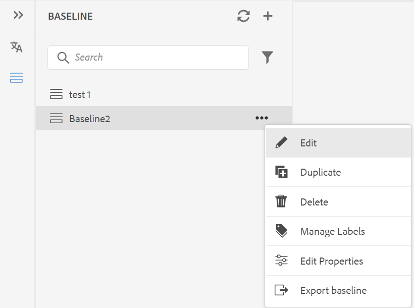
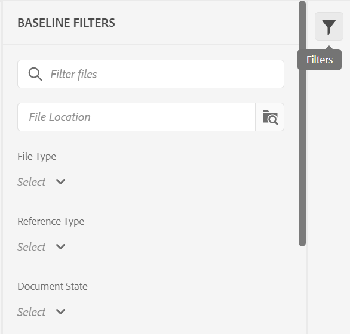

# 從Web編輯器建立和管理基準線 {#id223MB0ZF043}

>[!TIP]
>
> 如果您已升級至AEM Guidesas a Cloud Service三月版或更新版本，建議從網頁編輯器使用此基準線功能。

AEM Guides提供整合在網頁編輯器中的基準線功能，可讓使用者建立基準線，並使用基準線來發佈或翻譯不同版本的主題。

## 建立基準線

您可以執行下列步驟，從Web編輯器建立基準線：

1. 在「存放庫」面板中，在「對映檢視」中開啟DITA map檔案。
1. 按一下 **管理** 標籤。 此 **基線** 面板會顯示DITA map的基準線。

   {width="800" align="left"}

1. 在 **基線** 面板，按一下右上方的+圖示。 您可以使用特定版本的主題和參考內容（可在特定日期和時間使用），或是使用為某個版本的主題定義的標籤，來建立基準線。
1. 輸入基準的名稱 **基準線名稱**.
1. 在 **基線選項**，您可以選擇 **使用檔案版本** 選項或 **使用標籤** 選項：

   **使用檔案版本**：您可以用特定版本的主題和參考內容（可在特定日期和時間使用），或用為主題版本定義的標籤來建立靜態基準線：

   - 在 **設定最新版本依據：** 選取下列其中一個選項：

      1. **日期** &lt;time stamp=&quot;&quot;>：在指定的日期和時間挑選主題的版本。
      1. **標籤**：選取此選項，以根據套用至主題的主題標籤挑選主題。 如果主題有為其指定的標籤，則標籤會列在下拉式清單中。 您可以從清單中選擇標籤。 您也可以在文字方塊中新增標籤。

         對於靜態基準線中的直接參照，標籤會從最新儲存的地圖版本中提取。 例如，如果您已建立標籤 `Label Release 1.0` 和 `Label Release 1.1` 主題A 1.0版和1.1版，然後將主題A新增至儲存為1.0版的地圖。在此情況下，您可以檢視標籤 `Label Release 1.0` 和 `Label Release 1.1` 靜態基準線標籤的下拉式清單中。

         當您選取 **標籤，** 您可以選擇直接和間接參照。
         - 對於DITA map中的直接參照，您可以選擇使用未套用指定標籤的最新版主題。

           >[!NOTE]
           >
           > 如果您輸入的標籤不存在，請選取選項 **不要建立基準線** 之後，基準線建立會失敗，並在「基準線」面板中的基準線名稱附近顯示錯誤訊息。

         - 對於DITA map中的間接參照，您會獲得一個額外選項，可以使用未套用指定標籤的最新版主題。 您也可以選擇 **自動挑選** 針對參照的內容，系統會自動挑選與參照內容版本相對應的參照內容版本。

         一旦您選取標籤或版本為日期，就會相應地選取地圖中所有參照的主題和媒體檔案。 此主題選取範圍未顯示在使用者介面上，但會儲存在後端。

   **使用標籤**：選取此選項以建立基準線，以根據套用至主題的主題標籤來挑選主題。

   根據標籤的基準線會動態更新。 如果您產生基準線、下載基準線或使用基準線建立翻譯專案，系統會根據更新的標籤動態挑選檔案。 例如，如果您已將標籤版本為1.0的主題版本1.2用於基準線，並使用標籤版本為1.0更新版本1.5，則基準線將會動態更新，而版本1.5將會使用。

   {width="550" align="left"}

   - **選取標籤**：如果主題有為其指定的標籤，標籤會列在 **選取標籤** 下拉式清單。 您可以從清單中選擇標籤。 先選取的標籤會獲得較高的優先順序。

     對於動態基準線，標籤會從最新儲存的版本和地圖目前的工作副本中提取。 例如，如果您已建立標籤   `Label Release A.1.0 ` 和 `Label Release A.1.1` 適用於主題A 1.0和1.1版及標籤 `Label Release B.1.0` 和 `Label Release B.1.1` 適用於主題B 1.0和1.1版。 然後，您可以新增主題A至1.0版中的「對應A」，新增主題B至1.0*版中的「對應A」（工作復本）。 在此案例中，您可以檢視  `Label Release A.1.0 `， `Label Release A.1.1`， `Label Release B.1.0`、和 `Label Release B.1.1` 在動態基準線標籤的下拉式清單中。

1. **間接引用**：針對DITA map中的間接參照，提供下列選項：

   - **自動挑選**：您可以選擇 **自動挑選** 針對參照的內容，系統會自動挑選與參照內容版本相對應的參照內容版本。

   - **使用選取的標籤**：您可以使用為某個版本的主題定義的所選標籤來建立基準線。
   - **使用最新版本或工作復本**：使用未套用指定標籤之主題的最新版本，或如果未建立任何版本，則使用主題的工作復本來建立基準線。
1. 按一下「**套用**」。

會建立基準線。 基準線建立是非同步進行的，因此您可以在網頁編輯器中繼續處理其他檔案。 建立基準線後，會顯示快顯訊息，確認基準線已建立，您也會收到該基準線的收件匣通知。

## 管理基準線

您可以使用「基準線」圖示板上的各種功能來管理現有的基準線。

- 您可以使用「基線」面板中的文字方塊來搜尋現有的基線。 使用 **套用篩選器** 圖示顯示所有基準或列出建立狀態為「成功」、「進行中」或「失敗」的基準線。
- 使用 **重新整理** 圖示重新檢查所有基準線，並顯示在「對映檢視」中開啟之DITA map的新的基準線清單。
- 您可以在「基線」面板的清單中按兩下基線，以檢視或編輯現有靜態基線的內容。 中央的基線編輯視窗會顯示DITA map檔案、map的內容或主題以及參照的內容。

  {width="800" align="left"}

  您也可以從「選項」功能表對基準線執行下列操作：

- **編輯**， **複製，** **重新命名**，或 **刪除** 現有的基準線。

  >[!NOTE]
  >
  >只建議對少量的參考變更執行靜態基準線的編輯操作。 不建議使用編輯操作來變更主要DITA map的版本，因為它必須重新計算所有參照。 這可能會造成大型DITA map的基準線更新失敗。 對於較大的DITA map，您可以建立新基準線或編輯基準線的屬性。
  >
  >當使用標籤在執行階段產生動態基準的參照時，動態基準的編輯作業可讓您編輯基準的屬性。

- 從新增、移除或變更現有標籤 **管理標籤** 靜態基準線的選項。 如果您的管理員已設定預先定義的標籤，則您會在「新增標籤」下拉式清單中顯示這些標籤。 如需新增標籤的詳細資訊，請參閱 [使用標籤](web-editor-use-label.md#).

  >[!NOTE]
  >
  > 新增或移除標籤的程式是非同步進行的，因此您可以在網頁編輯器中繼續處理其他檔案。 新增或移除標籤後，會顯示快顯訊息，確認已新增或移除標籤，且您也會收到該標籤的收件匣通知。

- **編輯屬性** 建立基準線時設定的現有靜態基準線。
- 使用將基準線的快照匯出Microsoft Excel檔案 **匯出基準線** 選項。

**基線篩選**

使用中的篩選器圖示 **基線篩選** 面板您可以在基線編輯視窗中開啟的基線上套用篩選器：

{width="300" align="left"}

- 根據檔案名稱或檔案位置篩選檔案。
- 根據不同欄的值（如「檔案型別」、「參照型別」等）篩選檔案。
- 選擇要顯示在基準線編輯視窗中的欄。

>[!NOTE]
>
> 您可以按一下欄標題，並根據基準線編輯視窗中的欄來排序檔案。

**儲存或重設基準線**

編輯基準線後，您可以按一下 **儲存** 按鈕以儲存對基準線的變更。 您可以按一下 **重設** 按鈕（如果您不想儲存變更並重設基準線）。 當您按一下 **重設** 按鈕會顯示警告，指出您未儲存的變更將會遺失。

**父級主題：**[&#x200B;使用網頁編輯器](web-editor.md)
