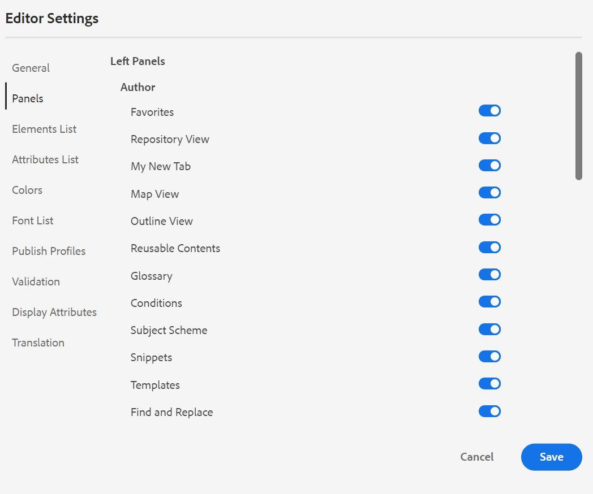
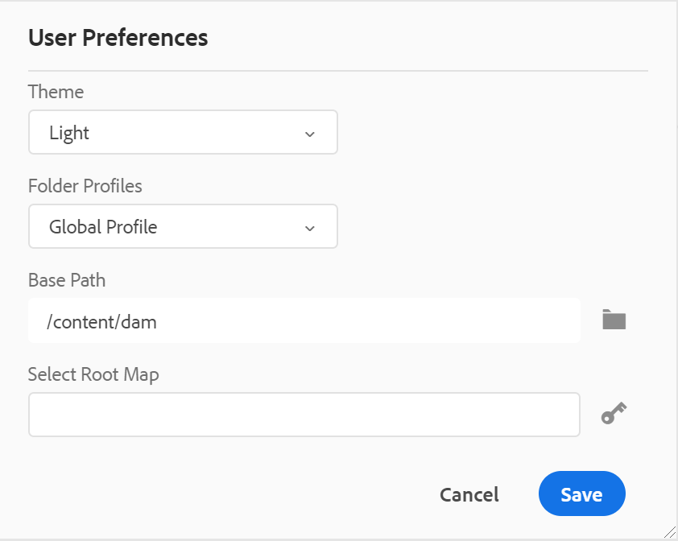
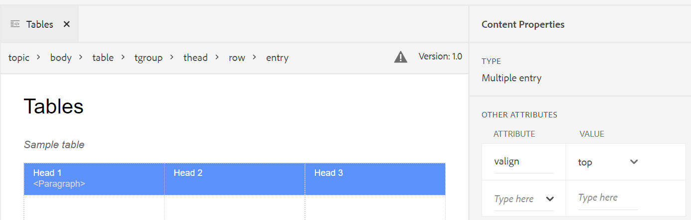
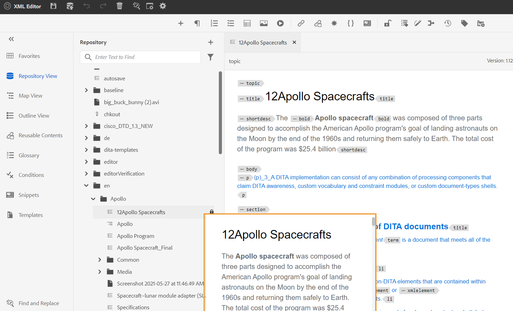
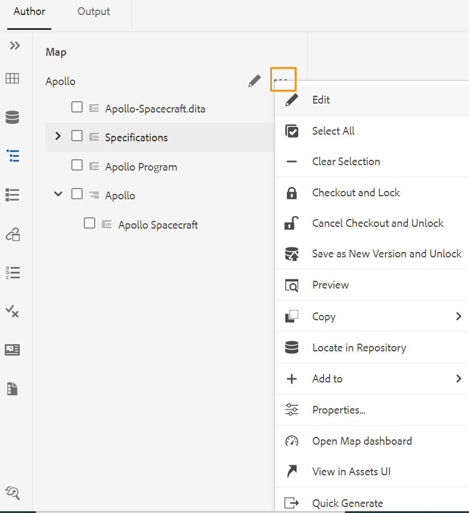
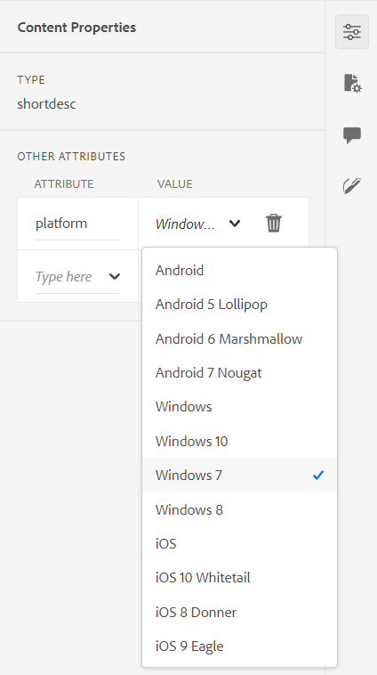
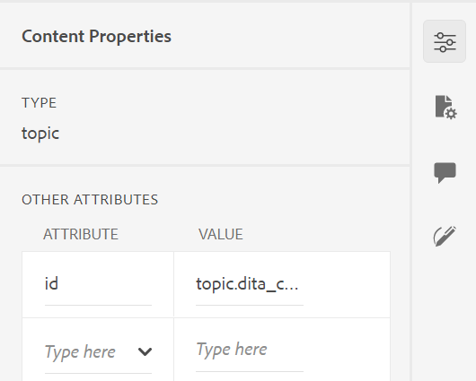
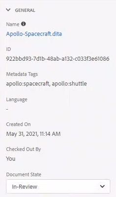

# 瞭解網頁編輯器功能 {#id176NC500V5Z}

本節將逐步說明網頁編輯器中可用的各種功能。 我們可以將Web編輯器分成下列區段或區域：

- [主工具列](#id2051EA0G05Z)
- [次要工具列](#id2051EA0J0Y4)
- [左側面板](#id2051EA0M0HS)
- [內容編輯區域](#id2051EB000UI)
- [右側面板](#id2051EB003YK)

以下小節將詳細介紹網頁編輯器的各個區段。

## 主工具列 {#id2051EA0G05Z}

主工具列位於網頁編輯器介面的頂端，並提供網頁編輯器中可用的檔案層級功能和各種撰寫模式。 上方工具列中的可用功能說明如下：

**儲存全部** - 

儲存您在所有開啟的主題中所做的變更。 如果您在網頁編輯器中開啟了多個主題，請按一下 **全部儲存** 或使用 **Crtl**+**S** 按一下快速鍵即可儲存所有檔案。 您不必個別儲存每個檔案。

>[!NOTE]
>
> 「儲存」作業不會建立主題的新版本。 若要建立新版本，請選擇「另存為新版本」。

**另存為新版本** - 

儲存您在主題中所做的變更，並建立主題的新版本。 如果您正在處理新建立的主題，版本資訊會顯示為 **無**.

{width="800" align="left"}

版本編號會隨著為主題或對應檔案建立的每個新版本而變更。

當您選擇儲存主題或地圖時，使用 **另存為新版本**，下列對話方塊就會顯示：

{width="300" align="left"}

輸入註釋和版本標籤以識別變更，然後按一下 **儲存** 以建立檔案的新版本。

當您選擇 *另存為新版本*，此主題的第一版會在DAM中建立，也會成為您目前使用中的主題版本。 稍後，如果您回覆成舊版主題，該版本就會成為您目前使用中的主題版本。

如果您的管理員有預先設定的版本標籤，您會在下拉式清單中看到這些標籤。 您可以從可用標籤清單中選擇標籤，並儲存檔案。

{width="300" align="left"}

儲存主題時，您可以新增註解，指定您在主題中所做的變更。 此註解會顯示在主題的版本記錄中。

如果您的主題正在稽核中，稽核者會收到通知，指出有較新版本的主題可用。 他們可以輕鬆存取您檔案的最新修訂版，並繼續檢閱您主題的最新版本。

當您將指標停留在主題的標題上時，會顯示檔案路徑和版本號碼。

{width="800" align="left"}

>[!NOTE]
>
> 主題版本推出後，您也可以在主題中新增標籤。 這些標籤可用來建立基準線，以發佈檔案的特定版本。 如需在主題中使用標籤的詳細資訊，請參閱 [使用標籤](web-editor-use-label.md#).

**還原和重做** -  / 

復原或重做上一個動作。

**刪除元素** - 

刪除目前選取的元素或游標所在的元素。

**尋找和取代** - 

「尋找和取代」功能在「作者」和「來源」檢視模式中可用。 「尋找和取代」文字列會出現在主題編輯區域的底部。 您可以使用快速鍵 **CTRL**+**F** 以叫用尋找和取代列。

{width="800" align="left"}

使用設定圖示\(\)，您可以切換 **忽略大小寫** 和 **僅限全字** 搜尋選項。 若要執行不區分大小寫的搜尋，請開啟\（或選取\） **忽略大小寫** 選項。 否則，如果您要執行區分大小寫的搜尋，請關閉\（或取消選取\） **忽略大小寫** 選項。 您也可以選擇搜尋整個單字。

搜尋是即時進行的，這表示當您在 **尋找** 欄位中，系統會立即搜尋字詞並在主題中加以選取。 同樣地，若要取代主題中的文字，請在個別欄位中輸入搜尋字詞及其取代字詞，然後按一下 **Replace** 或 **全部取代** 按鈕。

在「來源」檢視中，「尋找和取代」對於搜尋特定元素或屬性非常有用。 例如，如果要取代 `@product` 屬性，可以從「來源」檢視輕鬆完成。 「作者」檢視不允許您根據屬性或元素進行搜尋。 不過，您在使用時，必須小心 **全部取代** 功能，因為它可能會覆寫XML程式碼。

**編輯器設定** - 

編輯器設定僅供管理使用者使用。 管理員可使用偏好設定來設定下列設定：

>[!NOTE]
>
> 如果您要更新任何預設設定，則應重新開啟檔案，以使變更生效。

- **一般**：一般設定可讓您設定要與Web編輯器搭配使用的字典。 此標籤包含三個區段： **拼字檢查**， **條件**、和 **製作**.

   {width="650" align="left"}

   - **拼字檢查**：有兩個選項 —  **AEM拼字檢查** 和 **瀏覽器拼字檢查**. 依預設，編輯器會使用瀏覽器拼字檢查功能，其中拼字檢查是使用瀏覽器的內建字典執行。 您可以切換至AEM拼字檢查以使用AEM字典，您也可以自訂字典以新增自訂字詞清單。 如需自訂AEM字典的詳細資訊，請參閱 *自訂AEM預設字典* 安裝與設定Adobe Experience Manager Guidesas a Cloud Service中的區段。


   - **條件**

      - **在作者檢視中反白標示條件文字**：選取此項以在作者檢視中反白顯示條件文字。 條件內容會使用為條件定義的顏色反白顯示。

      - **使用條件屬性進行驗證**：選取此項以允許驗證為屬性定義的值。 這可防止您新增任何不正確的值。

      - **在「主旨配置」面板中顯示具有標題的金鑰**：選取此專案以顯示主旨配置中的索引鍵和標題。 如果您未選取此選項，只會顯示標題。 例如，這裡的索引鍵「os」、「audience」和「other」也會與標題一起顯示。

         {width="550" align="left"}

      - **在「條件」面板中顯示主旨配置**：選取此項以在條件面板中檢視主旨配置。 如果取消選取此選項，定義的條件將顯示在條件面板中。
   - **編寫**

      - **啟用全部取代**：選取此項以檢視「尋找和取代」面板中的「全部取代」圖示。


**面板**：此設定會控制編輯器左側面板中顯示的面板。 您可以切換開關以顯示或隱藏所需的面板。

{width="650" align="left"}

>[!NOTE]
>
> 如果已設定自訂面板，則它也出現在面板清單中。 您可以切換開關以顯示或隱藏自訂面板。 如需設定的詳細資訊，請參閱 *在左側面板中設定自訂面板* 安裝與設定Adobe Experience Manager Guidesas a Cloud Service中的區段。

- **元素清單**：管理員可透過以下專案控制作者可插入的元素清單： [插入元素](#id204SG30105Z) 快顯視窗，以及定義元素的顯示名稱。 「元素清單」設定可讓您根據DITA規格指定元素名稱，以及要使用的標籤，而不是DITA定義的元素名稱：

   {width="650" align="left"}

在上方熒幕擷圖中， `b` 元素已獲得粗體字的標籤， `codeblock` 會提供程式碼區塊的標籤，以及一些其他元素。 如果您選取 **僅使用以上元素** 選項，則只有此清單中的有效元素\（在目前的插入點\）會顯示在「插入元素」彈出式視窗中。

在下列熒幕擷圖中，先前熒幕擷圖的4個已設定元素中只有3個會顯示在目前的前後關聯中：

{width="300" align="left"}

- **屬性清單**：與「元素清單」類似，您可以控制要在元素的屬性清單中顯示的屬性清單及其顯示名稱。 在下列熒幕擷圖中，只有3個屬性已設定為顯示在元素的屬性清單中：

{width="650" align="left"}

透過此設定，當您嘗試將屬性新增至元素時，您只會看到清單中設定的屬性清單。

{width="300" align="left"}

- **顯示屬性**：如同「屬性清單」，您可以控制要在元素的屬性清單中顯示的屬性清單。 預設為四個 **顯示屬性**  — 對象、平台、產品和prop已設定為顯示在元素的屬性清單中。 您也可以使用 **新增** 圖示顯示。 您也可以使用刪除任何顯示屬性 **刪除** 圖示。

為元素定義的屬性會顯示在「配置圖」和「輪廓」檢視中。

{width="550" align="left"}

- **翻譯**：此標籤包含將來源標籤傳播至目標版本的選項。

   - **將來源版本標籤傳播到目標版本**：選取此選項可將來源檔案版本的標籤傳遞至翻譯的檔案。 預設為停用。

   {width="550" align="left"}


**使用者偏好設定** - 

「使用者偏好設定」可供所有作者使用。 作者可以使用偏好設定來設定以下設定：

{width="550" align="left"}

- **使用裝置主題**：選取此核取方塊，允許AEM Guides根據裝置的主題自動在淺色和深色主題之間切換。
- **主題**：您可以從編輯器的淺色、最亮、深色或最暗的主題中進行選擇。 如果主題最淺，工具列和面板會使用更淺的灰色背景。 如果是淺色主題，工具列和面板會使用淺灰色背景。 如果是最深的佈景主題，工具列和面板會使用較深的黑色背景。 若是深色主題，工具列和面板會使用黑色背景。 在所有主題中，內容編輯區域都會以白色背景顯示。

- **資料夾設定檔**：資料夾設定檔控制與條件屬性、製作範本、輸出預設集和網頁編輯器設定相關的各種設定。 預設會顯示「全域設定檔」。 此外，如果您的管理員在系統中設定了資料夾設定檔，則這些資料夾設定檔也會顯示在「資料夾設定檔」清單中。

   管理員可以在資料夾設定檔中定義的Web編輯器設定包括：自訂使用者介面，包括工具列圖示、Web編輯器的版面、片段和根對應。 如需詳細資訊，請參閱 *設定全域或資料夾層級設定檔* 在「安裝與設定Adobe Experience Manager Guides」as a Cloud Service中。

   >[!NOTE]
   >
   > 目前資料夾描述檔的名稱會在主工具列中顯示為「使用者偏好設定」圖示的標籤。

- **基底路徑**：根據預設，當您從網頁編輯器存取AEM存放庫時，您會看到來自/content/dam位置的資產。 您的工作資料夾很可能是/content/dam/資料夾內的幾個資料夾。 每次只要按幾下即可到達工作資料夾。 您可以將「基本路徑」設定為工作資料夾，然後將「存放庫檢視」顯示為該位置的前置內容。 這可以縮短存取工作資料夾的時間。 此外，當您在主題中插入任何參照或媒體檔案時，檔案瀏覽位置會以在「基本路徑」中設定的資料夾開始。

- **選取根對應**：選取DITA map檔案來解析索引鍵參照或字彙表專案。 選取的根對映擁有最高優先權可解析索引鍵參考。 如需詳細資訊，請參閱 [解析索引鍵參考](map-editor-other-features.md#id176GD01H05Z).


>[!NOTE]
>
> 如果您不想使用任何根對應，請確定 **選取根對應** 欄位為空白。

**作者、來源和預覽模式**

如需各種撰寫和檔案檢視模式的詳細資訊，請參閱 [Web編輯器檢視](web-editor-views.md#).

## 次要工具列 {#id2051EA0J0Y4}

當您在Web編輯器中開啟要編輯的主題時，次要工具列會出現。 次要工具列中可用的功能說明如下：

**插入元素** - 

在目前或下一個有效位置插入有效元素。 如果您在區塊元素內工作，例如 `note`，然後使用插入元素圖示，在 `note` 元素。 在下列熒幕擷圖中，筆記元素已插入p \(paragraph\)元素內：

{width="800" align="left"}

如果您在註記元素中按Enter鍵，會在註記元素本身中建立新段落。 若要在附註外插入新元素，請按一下元素階層連結中的p元素\（在熒幕擷圖中顯示為反白顯示\），然後按一下「插入元素」圖示或按 ***Alt***+***輸入*** 以開啟「插入元素」快顯視窗。 然後，選取所需的元素並按Enter鍵以插入選取的元素在註記元素之後。

當閃爍的區塊游標出現時，您也可以在兩個元素之間新增元素。

{width="300" align="left"}

例如，如果您正在處理DITA主題，而區塊游標在簡短說明與本文之間閃爍，則可以新增 `prolog` 元素，然後新增版權、作者和其他詳細資訊。

輸入新元素的另一種方法是使用快顯選單。 在檔案中的任何位置按一下滑鼠右鍵，以叫用前後關聯功能表。 從此選單中選擇插入元素以顯示插入元素對話方塊，並選擇要插入的元素。

{width="300" align="left"}

**插入段落** - 

在目前或下一個有效位置插入段落元素。

**插入/移除編號清單** - 

在目前或下一個有效位置建立編號清單。 如果您在編號清單中並按一下此圖示，專案會轉換為一般段落。

**插入/移除專案符號清單** - 

在目前或下一個有效位置建立專案符號清單。 如果您在專案符號清單中並按一下此圖示，專案會轉換為一般段落。

**插入表格** - 

在目前或下一個有效位置插入表格。 按一下「插入表格」圖示，開啟「插入表格」對話方塊：

{width="550" align="left"}

您可以指定表格中所需的列數和欄數。 如果要將第一列保留為表格標頭，請選取「將第一列設定為標頭」選項。 若要將標題新增至表格，請在「標題」欄位中輸入標題。

插入表格後，您可以使用前後關聯功能表來修改表格。

{width="550" align="left"}

使用表格的前後關聯功能表，您可以：

- 插入儲存格、列或欄

- 合併向右和向下方向的儲存格

- 水平或垂直分割儲存格

- 刪除儲存格、列或欄

- 從表格中建立程式碼片段

- 產生ID


您也可以在表格的多個儲存格、整列或欄上定義屬性。 例如，若要對齊表格儲存格，請拖曳並選取所需的儲存格。 在「內容屬性」面板\（在右側\）中，屬性 **型別** 變更為 **多個專案**. 在「其他屬性」段落中，選取 `@valign` 屬性下拉式清單中的屬性。 從值下拉式清單中，選取想要套用至所選表格儲存格的文字對齊方式。

{width="800" align="left"}

**插入影像** - 

在目前或下一個有效位置插入影像。 按一下「插入影像」圖示以開啟「插入影像」對話方塊，然後搜尋並選取您要插入的影像。

>[!NOTE]
>
> 您也可以將影像從本機系統拖放到文章上，以新增影像。 在此情況下，會使用新增影像檔案 **上傳資產** 工作流程。  如需詳細資訊，請參閱 **上傳資產** 中的工作流程 [左側面板](web-editor-features.md#id2051EA0M0HS) 區段。


{width="650" align="left"}

您可以在「插入影像」對話方塊中為影像新增影像/插圖示題和替代文字。

您可以在頂端的「要搜尋的型別」列中輸入檔案名稱，以搜尋所需的影像檔案，也可依路徑\（要搜尋於\）、集合、檔案型別和標籤來篩選搜尋結果。 找到所需的影像檔案後，請選取該檔案，然後按一下「選取」將影像插入檔案中。 您可以插入各種格式的影像檔案，例如 `.png`， `.svg`， `.gif`， `.jpg`， `.eps`， `.ai`， `.psd`、等等。

插入影像後，您可以從「內容屬性」面板變更高度、寬度、位置和屬性。 按一下影像檔案，然後在右側欄的「內容屬性」面板中進行變更。

{width="800" align="left"}

「來源」欄位會顯示所插入影像檔案的UUID。 您可以將滑鼠指標暫留在「來源」欄位上，以找到插入影像檔案的完整路徑。 路徑會顯示在工具提示中。

您可以藉由為影像檔案提供「高度」或「寬度」值來調整影像大小。 影像的外觀比例會自動維持不變。 您也可以按一下鎖定圖示\(「保持長寬比」(Maintain Aspect Ratio)的\)並提供「高度」(Height)和「寬度」(Width)值，選擇不保持影像檔案的長寬比。

您也可以將影像的「位置」設定指定為「內嵌」或「破斷」。 如果您選擇使用「破斷點位置」選項，則可以選擇對齊影像的位置\（左、中或右\）。

您也可以為影像檔案新增其他屬性，方法是選取 **屬性** 欄位。

>[!NOTE]
>
>您也可以定義影像中的可點按區域\（影像地圖\）。 如需詳細資訊，請參閱 **插入/編輯影像地圖** 中的功能說明 [左側面板](web-editor-features.md#id2051EA0M0HS) 區段。

**影像或媒體檔案的快顯功能表**

您也可以使用快顯選單對影像和媒體檔案執行一些常見操作。 在影像上的任何位置按一下滑鼠右鍵，以叫用內容功能表。

快顯選單提供剪下、複製或貼上影像或媒體的選項。 您可以在選取的元素之前或之後插入元素。 您也可以選擇重新命名或取消繞排元素。 您可以在存放庫中找出選取的影像或媒體，或在Assets UI中檢視檔案預覽。

快顯選單中的其他選項可讓您複製路徑、編輯影像地圖、建立代碼片段，或為選取的元素產生ID。

**插入多媒體** - 

插入不同型別的多媒體檔案。 按一下「插入多媒體」圖示，然後選擇要插入的檔案型別。 支援的多媒體格式包括：

- 音訊檔案
- 視訊檔案
- YouTube
- Vimeo

選取「音訊或視訊」檔案選項時，系統會顯示儲存庫檢視，讓您瀏覽並選取所需的檔案。 如果您選擇YouTube或Vimeo，則會顯示「插入多媒體」對話方塊。 在「網頁連結」欄位中貼上視訊檔案的連結，然後按一下「插入」，將視訊新增至檔案中的目前或下一個有效位置。

>[!NOTE]
>
> 新增YouTube影片連結時，您需要取代字串 `watch?v=` 替換為 `embed` 在URL中。 例如，若要新增YouTube影片連結： `https://www.youtube.com/**watch?v**=WlIKQOrmZcs`，您需要將其新增為： `https://www.youtube.com/**embed/**WlIKQOrmZcs`. 這項變更可確保影片嵌入到AEM網站和PDF輸出中。

您也可以從「插入多媒體」對話方塊新增音訊或視訊檔案。 選取「音訊/視訊檔案」選項，然後按一下瀏覽圖示以啟動存放庫檢視。 從儲存庫選取音訊或視訊檔案，然後按一下「選取」，在「音訊/視訊檔案」欄位中新增檔案的連結。 如果您選擇視訊檔案，則該檔案的預覽也會顯示在「預覽」區域中。 您可以播放視訊檔案以檢視其預覽。

{width="650" align="left"}

**插入交叉參照** - 

插入參照型別 — 內容參照、內容索引鍵參照、索引鍵參照、檔案參照、網頁連結或電子郵件連結。

按一下 **選取檔案** 圖示\（用於內容參考和檔案參考\）或 **選取地圖** 圖示\（代表內容索引鍵參考和索引鍵參考\）並選取要連結到的所需檔案或內容。

{width="650" align="left"}

所選參照的連結會新增到檔案中。 連結上的內容功能表為您提供下列選項：

- **插入元素**：顯示您可以在指定內容插入的有效元素清單。
- **複製UUID**：複製插入參照的UUID。
- **複製路徑**：複製插入參照的完整路徑。
- **建立代碼片段**：從插入的參照中建立可重複使用的程式碼片段。
- **產生ID**：為插入的參照產生唯一ID。

您也可以使用要參照之檔案的UUID來搜尋。 針對「內容」和「鍵參照」連結，輸入您要連結之檔案的UUID，系統就會自動搜尋該檔案，並將其顯示在「預覽」區段中。 當您指定檔案的UUID時，您不需要明確提及.xml檔案的副檔名。 .xml副檔名會自動附加至UUID。

{width="650" align="left"}

如果您的管理員已啟用UUID選項 *XMLEditorConfig*，您就會在「 」中看到參考內容的UUID **連結** 屬性。

{width="800" align="left"}

>[!NOTE]
>
> 如果 **啟用UUID** 選項，則會顯示參照內容的相對路徑。

>[!IMPORTANT]
>
> 即使參考內容的相對路徑顯示在 **連結** 屬性，內部連結是使用參考內容的UUID建立。

>[!TIP]
>
> 如需參考內容的最佳實務，請參閱最佳實作指南中的參考資料區段。

**篩選搜尋**

您可以在AEM存放庫所選路徑上的檔案中搜尋某些文字。 例如，「general」會在下列指定的熒幕擷圖中進行搜尋。 您也可以使用增強型篩選器來縮小搜尋範圍。 您可以尋找所有DITA檔案，例如DITA主題和DITA Map出現在所選路徑上。

您可以在選取的路徑中搜尋非DITA檔案，例如影像檔案、多媒體和檔案。 您也可以搜尋DITA元素屬性中的特定值。 您也可以尋找由指定使用者出庫的檔案。

{width="650" align="left"}

>[!NOTE]
>
> 您的系統管理員也可以設定文字篩選器，並顯示或隱藏其他篩選器。 如需詳細資訊，請參閱安裝和設定Adobe Experience Manager Guidesas a Cloud Service中的設定文字篩選條件一節。

將顯示包含搜尋文字的篩選檔案清單。 例如，在上面的熒幕擷圖中，會列出包含「一般」文字的檔案。 您也可以預覽檔案的內容。

**插入可重複使用的內容** - 

重複使用專案中任何其他檔案內存在的內容。 您可以直接連結至檔案中的內容或使用索引鍵參照來插入內容，請參閱 [解析索引鍵參考](map-editor-other-features.md#id176GD01H05Z). 按一下「插入可重複使用的內容」圖示，您會看到「重複使用內容」對話方塊：

{width="650" align="left"}

在「重複使用內容」對話方塊中，選取檔案參照的DITA檔案或包含關鍵參照的DITA map檔案。 選取後，對話方塊中會顯示主題或關鍵參照。 您可以選取要插入的主題的ID/索引鍵，然後按一下完成來插入主題中的內容。

若要插入「內容參照」，您也可以輸入檔案的UUID，且該檔案中可重複使用的內容會列在「預覽」區段中。

根據插入連結的設定，您可以在「屬性」面板或「原始程式碼」檢視中看到插入內容的UUID或相對路徑。 連結一律會使用參考內容的UUID建立。 請參閱安裝和設定Adobe Experience Manager Guidesas a Cloud Service中的「設定UUID型連結」 。

>[!NOTE]
>
> 若要在參照的內容之前或之後新增內容，請使用 *Alt*+*左側* 箭頭或Alt+*右* 箭頭鍵，將游標移動到所需的位置。

您也可以以滑鼠右鍵按一下參照的內容，然後選擇「 」，將參照的內容內嵌在主題中 **以內容取代參考** 從快顯選單中。

**插入特殊字元** -  

在主題中插入特殊字元。 按一下「插入特殊字元」圖示，開啟「插入特殊字元」對話方塊。

>[!NOTE]
>
> AEM Guides提供可移動和可調整大小的對話方塊。 可以在右下角調整具有兩條交叉線的對話方塊大小。 「特殊字元」對話方塊中的交叉線顯示如下。

{width="550" align="left"}

在「插入特殊字元」對話方塊中，您可以使用特殊字元的名稱來搜尋特殊字元。 所有特殊字元都儲存在各種類別下。 使用「選取類別」下拉式清單並選取類別。 會顯示所選類別中可用的特殊字元。 您可以使用方向鍵導覽特殊字元清單，或按一下要插入的所需字元。 所選特殊字元的「名稱」和「十六進位代碼」會顯示在清單下方。 按一下「插入」，將選取的字元插入檔案中。

**插入關鍵字** - 

插入在DITA map中定義的關鍵字。 按一下「插入關鍵字」圖示以開啟「鍵參照」對話方塊。

{width="550" align="left"}

關鍵字會依字母順序列出，您也可以在「搜尋」方塊中輸入搜尋字串來搜尋關鍵字。 搜尋結果會傳回包含ID或值字串的關鍵字。 DITA map中定義的關鍵字會列在此對話方塊中。 選擇要插入的關鍵字，然後按一下 **插入**.

您也可以以滑鼠右鍵按一下關鍵字，並選取「屬性」選項來變更插入關鍵字的屬性。 「關鍵字的屬性」對話方塊開啟：

{width="550" align="left"}

您可以變更關鍵字的屬性或新增屬性至關鍵字。

**插入代碼片段** - 

在目前或下一個有效位置插入程式碼片段。 若要讓此功能運作，您必須在系統中定義代碼片段。 如需新增程式碼片段的詳細資訊，請參閱 **代碼片段** 中的功能說明 [左側面板](web-editor-features.md#id2051EA0M0HS) 區段。

按一下「插入程式碼片段」圖示，畫面會顯示插入程式碼片段目錄。 目錄是內容感應式的，這表示只有在目前位置允許片段時，才會顯示片段。

以下範例顯示兩個預先設定的片段 — 可在檔案中目前位置插入的「警告」和「錯誤」。

{width="300" align="left"}

當您從清單中選擇程式碼片段時，它會插入檔案中目前或下一個有效位置。 下列熒幕擷圖顯示插入檔案中的錯誤程式碼片段：

{width="400" align="left"}

**插入/編輯影像地圖** - 

在選取的影像上插入影像地圖。 含有連結至主題或網頁之可點按區域的影像稱為影像地圖。

在目前主題中選取影像，然後按一下「插入/編輯影像地圖」圖示，以開啟「插入影像地圖」對話方塊。

{width="650" align="left"}

選擇偏好的形狀矩形 ，圓形 ，或多邊形  定義影像上要作為連結的區域。 定義區域後，會出現「參照」對話方塊，您必須在其中指定內部或外部內容的連結：

{width="650" align="left"}

如果區域重疊，您可以按一下工具列中的個別圖示，將形狀向前或向後傳送。 您也可以選取某個區域並按一下「刪除」圖示來移除該區域。 連按兩下某個區域會開啟「參照」對話方塊，您可以在其中變更目的地連結。 在影像上標籤所需區域後，按一下「完成」儲存變更。

**鎖定/解鎖** - / 

鎖定或解除鎖定目前的檔案。 鎖定\（或簽出\）檔案可為使用者提供該檔案的獨佔寫入許可權。 當檔案為「已解鎖\（或已簽入\）」時，變更會儲存在檔案的目前版本中。

如果您在「對映檢視」中並展開父對映，只要按一下即可鎖定對映中的所有檔案。 只要展開父對映檔案並選取父檔案即可，如此即可選取對映中的所有檔案。 接著，您可以按一下「鎖定」圖示，以鎖定地圖中的所有檔案。

**切換標籤檢視** - 

標籤是指示元素邊界的視覺提示。 元素邊界會標籤元素的開始和結束。 然後，您可以使用這些邊界作為視覺提示，來放置插入點或選取邊界內的文字。 如果要在檔案中的元素之前或之後插入另一個元素，可將插入點置於元素的開啟或關閉邊界之前或之後。

下列熒幕擷圖顯示開啟標籤檢視的檔案：

{width="650" align="left"}

下列操作可在開啟標籤檢視的檔案中執行：

- **選取元素**：按一下元素的開頭或結尾標籤，以選取其內容。

- **展開或收合標籤**：按一下+或 — 登入標籤以展開或收合。

- **使用內容功能表**：快顯選單提供剪下、複製或貼上所選元素的選項。 您也可以在選取的元素之前或之後插入元素。 其他選項可讓您為選取的元素產生ID或開啟「屬性」面板。

- **拖放元素**：選取元素的標籤，並將其輕鬆拖放至您的檔案上。 如果放置位置是允許元素的有效位置，則元素會放置在放置位置。


>[!NOTE]
>
> 如果使用者從Web編輯器啟用「標籤檢視」，即使跨工作階段，該檢視仍會保持啟用狀態。 這表示您不需再啟用「標籤檢視」即可稍後存取。新使用者工作階段的「標籤檢視」預設值由ui\_config.json檔案中的tagsView屬性決定。 如需詳細資訊，請參閱 *設定標籤檢視的預設值* 部分(在as a Cloud Service安裝與設定Adobe Experience Manager Guides中)。

**啟用/停用追蹤變更** 

您可以啟用「追蹤變更」模式，以追蹤檔案上所做的所有更新。 啟用追蹤變更後，所有插入和刪除動作都會擷取到檔案中。 所有已刪除的內容會使用「刪除線」反白顯示，而所有插入會以綠色文字反白顯示。 此外，您也會在主題頁面的邊緣取得變更列。 再次重申，刪除的內容會顯示紅色列，新增的內容會顯示綠色列。 如果同一行有新增和刪除專案，則會同時顯示綠色和紅色長條。

下列熒幕擷圖會反白標示刪除和插入的內容以及變更列：

{width="650" align="left"}

追蹤檔案中變更的典型使用案例可能是進行同級審閱。 您可以啟用追蹤變更並共用您的檔案以供檢閱，然後檢閱者進行變更並開啟追蹤變更。 當您收到檔案時，您應該具有檢視建議更新的機制，以及接受或拒絕變更的便利方式。

AEM Guides提供追蹤變更功能，其中包含有關檔案中所做更新的資訊。 「追蹤的變更」功能提供有關已進行哪些更新、誰進行這些更新，以及何時進行的資訊。 使用「追蹤的變更」功能，您也可以輕鬆地接受或拒絕檔案中建議的更新。

若要存取該功能，請按一下右側面板中的「追蹤的變更」圖示。

{width="300" align="left"}

按一下變更會選取檔案中已變更的內容。 您可以選取「接受變更」圖示來接受變更，或選取「拒絕變更」來拒絕變更。

如果您要按一下以接受或拒絕所有變更，請選取 **全部接受** 或 **全部拒絕**.

>[!NOTE]
>
> 「預覽」模式可讓您檢視包含或不包含變更內容標籤的檔案。 如需詳細資訊，請參閱 [預覽](web-editor-views.md#preview-mode-id19AAGL00163) 模式。

**合併** - 

當您在多作者環境中工作時，很難追蹤其他作者在主題或地圖中所做的變更。 「合併」功能可讓您更進一步控制檢視變更，以及哪些變更會保留在最新版本的檔案中。

**合併主題檔案**

若要合併主題中的變更，請執行下列步驟：

1. 在Web編輯器中開啟主題。

1. 按一下 **合併**.

   「合併」對話方塊隨即顯示。

   {width="550" align="left"}

1. *\（可選\）* 您也可以瀏覽並從存放庫中的其他位置選取新檔案。

1. 選取要與檔案目前版本進行比較的檔案版本。

1. 從「選項」中選擇：

   - **追蹤所選版本的變更**：此選項會以追蹤變更的形式顯示所有內容更新。 然後，您可以選擇一次接受或拒絕一個檔案變更，或一次接受或拒絕所有檔案變更。

   - **回覆成選取的版本**：此選項會將檔案的目前版本還原為所選版本。 此選項無法讓您控制接受或拒絕哪些內容。

1. 按一下 **完成**.

1. 如果您已選取 **追蹤從選取的版本變更** 選項，則所選版本的所有變更都會顯示在右側面板的追蹤變更功能中。

   您可以在「追蹤的變更」面板中選擇接受或拒絕所有註解，或接受或拒絕個別註解。


**合併對應檔案**

若要合併對映檔案中的變更，請執行下列步驟：

1. 在網頁編輯器中開啟對應。

1. 按一下 **合併**.

   「合併」對話方塊隨即顯示。

   {width="550" align="left"}

1. *\（可選\）* 您也可以瀏覽並從存放庫中的其他位置選取新檔案。

1. 選取要與檔案目前版本進行比較的檔案版本。

1. 從「選項」中選擇：

   - **追蹤所選版本的變更**：此選項會以追蹤變更的形式顯示所有內容更新。 然後，您可以選擇一次接受或拒絕一個檔案變更，或一次接受或拒絕所有檔案變更。

   - **回覆成選取的版本**：此選項會將檔案的目前版本還原為所選版本。 此選項無法讓您控制接受或拒絕哪些內容。

1. 按一下 **完成**.

   1. 如果您已選取 **追蹤從選取的版本變更** 選項，則所選版本的所有變更都會顯示在「追蹤的變更」面板\（位於右側）中。

      您可以從「追蹤的變更」面板選擇接受或拒絕所有變更，或接受或拒絕對應檔案中的個別變更。


**版本記錄** - 

AEM Guides提供多種方法來檢視針對您的主題檔案建立的版本，以及還原至特定版本的方法。 不過，這些功能中的大部分都可在網頁編輯器之外使用。

網頁編輯器中的「版本記錄」功能不僅可讓您檢查使用中主題上的可用版本和標籤，還可讓您靈活地從編輯器本身回復到任何版本。

若要存取版本記錄並還原至主題的特定版本，請執行下列步驟：

1. 在Web編輯器中開啟主題。

1. 按一下 **版本記錄**.

   「版本記錄」對話方塊隨即顯示。

   {width="550" align="left"}

1. 選擇您要在中還原的主題版本 **選取版本** 下拉式清單。

   >[!NOTE]
   >
   > 如果版本套用了標籤，也會連同版本編號一起顯示\（在方括弧中）。

   從下拉式清單中選擇版本後，即可使用回覆至所選版本選項。 預覽視窗會顯示目前版本與所選主題版本之間的差異。

   {width="550" align="left"}

1. 按一下 **回覆成選取的版本** 將工作副本還原為所選版本的主題。

   「回覆版本」對話方塊隨即顯示。

   {width="550" align="left"}

1. \(*可選*\)提供回覆至舊版的原因。 您也可以建立主題目前作用中工作副本的新版本。

1. 按一下 **確認。**

   您的檔案工作復本將還原為所選版本。 如果您選擇建立目前作用中工作副本的新版本，則也會建立包含所有工作變更的新版本檔案。


當您回覆至較早的版本時，會顯示視覺提示，指出您目前使用的版本不是最新版本。

{width="800" align="left"}

**版本標籤管理** -  

標籤可協助您識別特定主題在DDLC \（檔案開發生命週期\）中的階段。 例如，當您處理主題時，可以將標籤設定為「已核准」。 主題發佈並可供客戶使用後，您可以為該主題指派「已發行」標籤。

AEM Guides可讓您以自由格式文字格式指定標籤，或使用一組預先定義的標籤。 自訂標籤可讓系統中的任何作者根據其選擇指定標籤。 這提供了靈活性；但是，它會在系統中引入不一致的標籤。 若要克服此問題，管理員可以設定一組預先定義的標籤。 如需有關設定預先定義標籤的詳細資訊，請參閱 *設定和自訂XML Web編輯器* 在「安裝與設定Adobe Experience Manager Guides」as a Cloud Service中。

這些標籤會以下拉式清單的形式顯示給需要指定標籤的作者。 這樣可確保系統中只會使用預先定義、一致的標籤。

您可以透過不同的方法將標籤套用至主題 —  [版本記錄](web-editor-use-label.md#) Assets UI中的面板， [基準線](/help/tutorials/user-guide/generate-output-use-baseline-for-publishing.md#id184KD0T305Z) UI和Web編輯器。 網頁編輯器中的版本標籤功能可讓作者快速輕鬆地為其主題指派標籤。

若要從Web編輯器將標籤新增至主題，請執行以下步驟：

1. 在Web編輯器中開啟主題。

1. 按一下 **版本標籤**.

   「版本標籤管理」對話方塊隨即顯示。

   {width="650" align="left"}

   「版本標籤管理」對話方塊分為兩個部分：左側面板包含可用於主題的版本清單，以及標籤下拉式清單\（或用於輸入標籤的文字方塊\），右側面板包含主題預覽。

1. 選取您要套用標籤的版本。

   當您從版本清單中選擇不同的主題版本時，預覽面板會顯示目前版本和所選主題版本之間的變更

   >[!NOTE]
   >
   > 如果標籤已套用至版本，則會顯示在下拉式清單中的版本編號旁邊，以及「選取版本」清單的下方。 您可以按一下\(**x**\)圖示加以識別。

1. 如果您的管理員已定義標籤清單，則會顯示一個標籤下拉式清單，您可以從中選擇要套用的標籤。 您可以從下拉式清單中選取多個標籤。

   否則，您會看到一個文字方塊，您可以在其中輸入要新增至主題的標籤。

   >[!NOTE]
   >
   > 您無法在一個主題的多個版本上套用相同的標籤。 如果您嘗試關聯現有標籤，則會提供從現有版本中移除該標籤，並將其套用至所選主題版本的選項。

1. 按一下 **新增標籤**.

1. 在「套用標籤」確認訊息中，選取 **移動標籤** 將標籤從現有版本移動到所選版本的選項。 如果您未選取此選項，並且有標籤指派給不同的主題版本，則這些標籤不會移動到所選主題的版本。 在標籤套用程式中會忽略此類標籤。


**建立稽核任務** -  

您可以直接從Web編輯器建立目前主題的稽核任務或對映檔案。 開啟您要建立複查工作的檔案，然後按一下「建立複查工作」以啟動複查建立程式。

>[!NOTE]
>
> 您也可以從「稽核」面板\（位於右側）建立稽核任務。

依照以下說明操作： [檢閱主題或地圖](review.md#) 以取得更多詳細資料。

## 左側面板 {#id2051EA0M0HS}

左側面板是持續面板。 您可以按一下展開側邊欄圖示\(\)。 在展開的檢視中，它會顯示圖示的名稱，這些圖示會在收合的檢視中顯示為工具提示。

>[!NOTE]
>
> 左側面板可調整大小。 若要調整面板大小，請將游標置於面板邊界上，游標會變更為雙箭頭並按一下並拖曳以調整面板寬度。

左側面板可讓您存取下列功能：

**我的最愛** -  

如果您使用一組檔案或資料夾，可以將它們新增至您最喜愛的清單，以便快速存取。 「我的最愛」清單會顯示您已新增的檔案清單，以及其他使用者公開可存取的我的最愛檔案清單。

若要建立我的最愛清單或集合，請按一下「我的最愛」面板旁的+圖示以開啟「新增集合」媒體記錄：

{width="300" align="left"}

輸入您想要建立的最愛集合的標題和說明。 如果您選取 **公用**，則其他使用者也會看見此我的最愛。

若要將檔案新增至您最喜愛的收藏集，請使用下列任一方法：

- 在「存放庫檢視」中瀏覽至所需的檔案或資料夾，按一下 *選項* 圖示以開啟內容功能表，然後選擇 **新增至我的最愛**. 在「新增至我的最愛」對話方塊中，您可以選擇將檔案/資料夾新增至現有的我的最愛或建立新的檔案/資料夾。

   {width="300" align="left"}

- 在編輯器中的檔案索引標籤上按一下滑鼠右鍵，開啟快顯選單。 選擇 **新增至\>我的最愛** 以將檔案新增至您的最愛清單。

   {width="400" align="left"}


**一下Favroties集合的「選項」功能表**\
您也可以使用「我的最愛」集合的「選項」選單來執行許多動作：

{width="400" align="left"}
- **重新命名**：重新命名選取的集合。
- **刪除**：刪除選取的檔案。
- **重新整理**：從存放庫取得新的檔案和資料夾清單。
- **在資產UI中檢視**：在Assets UI中顯示檔案或資料夾內容。


>[!NOTE]
>
> 您也可以使用上方的「重新整理」圖示重新整理清單。


**存放庫檢視** - 

當您按一下「存放庫檢視」圖示時，您會得到DAM中可用的檔案和資料夾清單。

一次載入75個檔案。 每次按一下 **載入更多**...已載入75個檔案，且列出所有檔案後，按鈕即停止顯示。 批次載入相當有效率，而且相較於載入資料夾中的所有檔案，您可以更快存取檔案。

您可以輕鬆導覽至DAM內的必要檔案，並在Web編輯器中開啟它。 如果您擁有編輯檔案所需的存取許可權，則可以進行編輯。

您也可以按一下並在網頁編輯器中播放音訊或視訊檔案。 您可以變更音量或視訊檢視。 在捷徑功能表中，您也有下載、變更播放速度或檢視畫中畫的選項。


在地圖檔案上按兩下會在 **地圖檢視**. 如需詳細資訊，請參閱 **地圖檢視** 中的功能說明 [左側面板](web-editor-features.md#id2051EA0M0HS) 區段。 連按兩下主題檔案會在 [內容編輯區域](#id2051EB000UI). 能夠直接從網頁編輯器導覽及開啟檔案，可節省時間並提升生產力。

**篩選搜尋**

網頁編輯器為搜尋文字提供增強的篩選器。 按一下篩選搜尋\(\)圖示以開啟「篩選器」面板。 您可以在AEM存放庫所選路徑上的檔案中搜尋文字。 例如，「一般用途」會在下列指定的熒幕擷圖中進行搜尋。

{width="400" align="left"}

您也有以下選項可篩選檔案，以及縮小AEM存放庫中的搜尋範圍：

- **DITA檔案**：您可以尋找所有 **DITA主題** 和 **DITA Maps** 出現在選取的路徑上。
- **非DITA檔案**：您可以搜尋 **影像檔案**， **多媒體**、和 **檔案** 在選取的路徑中。
- **DITA元素**：您也可以搜尋指定DITA元素的屬性中的特定值。
- **簽出者**：您可以尋找由指定使用者簽出的檔案。
- **上次修改時間**：您可以尋找在選定日期之後但在選定日期之前上次修改的檔案。 您也可以尋找過去2小時、上週、上個月或去年上次修改的檔案。
- **標籤**：您可以尋找已套用特定標籤的檔案。 您可以輸入標籤或從下拉式清單中選取標籤。

**注意：** 您的系統管理員也可以設定文字篩選器，並顯示或隱藏其他篩選器。 如需詳細資訊，請參閱 *設定文字篩選* 安裝與設定Adobe Experience Manager Guidesas a Cloud Service中的區段。

將顯示包含搜尋文字的篩選檔案清單。 例如，在上面的熒幕擷圖中，會列出包含「一般用途」文字的檔案。 您可以從篩選清單中選取多個檔案，將其拖放到開啟以進行編輯的對映中。

**選項功能表**

除了從左側面板開啟檔案外，您還可以使用

「存放庫檢視」中可用的「選項」功能表。 視您選擇資料夾、主題檔案或媒體檔案而定，您會看到不同的選項。

**資料夾的選項**

您可以使用可用的「選項」選單執行下列動作 *資料夾* 在「存放庫檢視」中：

{width="550" align="left"}


- **建立**：建立新的DITA主題、DITA map或資料夾。 如需詳細資訊，請參閱  **從「存放庫檢視」建立主題** 中的程式 [左側面板](web-editor-features.md#id2051EA0M0HS) 區段。


- **上傳資產**：將檔案從本機系統上傳至AEM存放庫中選取的資料夾。 您也可以將檔案從本機系統拖放至目前的工作主題上。 如果您想要將本機系統的影像插入主題中，這個功能會非常有用。

   {width="550" align="left"}

   您可以選取要上傳檔案的資料夾，系統也會顯示影像預覽。 如果要重新命名檔案，可在「檔案名稱」文字方塊中重新命名。 按一下上傳，即可完成檔案上傳程式。 如果您在主題上拖放了影像檔案，則該影像檔案會新增到文章中，也會上傳該檔案。

   如果您的管理員已啟用UUID選項 *XMLEditorConfig*，您便會在中看到上傳影像的UUID **來源** 屬性。

   {width="800" align="left"}

- **在資料夾中尋找檔案**：將焦點移至存放庫搜尋，您可以在其中輸入搜尋字詞。 搜尋會在存放庫中選取的資料夾下執行。 您也可以套用篩選器以傳回DITA檔案、影像檔案或兩者。

   {width="400" align="left"}

   您也可以使用檔案的UUID進行搜尋。 在這種情況下，搜尋結果會顯示DITA/XML檔案的標題，而如果檔案是影像檔案，則會顯示檔案的UUID。 在下列搜尋範例中，會搜尋影像檔案的UUID，搜尋結果會顯示原始影像檔案的UUID和參照該影像的檔案主題標題。

   {width="300" align="left"}

- **全部收合**：摺疊存放庫中所有開啟的資料夾，並僅顯示根層級的資料夾。

   >[!NOTE]
   >
   > 使用 **\>** 圖示來展開資料夾。

- **新增至我的最愛**：將選取的資料夾新增至我的最愛。 您可以選擇將其新增至現有或新的「我的最愛」集合。

- **重新整理**：從存放庫取得新的檔案和資料夾清單。
- **在資產UI中檢視**：在Assets UI中顯示資料夾內容。

**檔案的選項**

視您選取的是媒體檔案還是DITA檔案而定，您會在「選項」選單中看到不同的選項。 媒體和DITA檔案的一些常見選項包括：

- 複製
- 簽出/簽入
- 預覽
- 移至
- 重新命名
- 刪除
- 複製
- 全部收合
- 新增至我的最愛
- 屬性
- 在資產UI中檢視

{width="550" align="left"}

「選項」選單中的各種選項說明如下：

- **編輯**：開啟檔案進行編輯。 若是.ditamap/.bookmap檔案，則會在 [進階地圖編輯器](map-editor-advanced-map-editor.md#) 進行編輯。

- **複製**：使用此選項可建立所選檔案的重複或副本。 您也可以選擇在重複資產提示中重新命名重複檔案。 依預設，檔案會以尾碼\（如filename\_1.extension\）建立。 檔案的標題會與來源檔案相同，而新檔案會從1.0版開始。複製所有參照、標籤和中繼資料時，基線不會複製到複製檔案中。
- **簽出**：鎖定選取的檔案以進行編輯。 若為鎖定的檔案，此選項會變更為 **簽入**.

   >[!NOTE]
   >
   > 如果檔案已由使用者鎖定或出庫，將滑鼠指標暫留在鎖定圖示上會顯示已鎖定檔案的使用者\(name\)。

- **預覽**：在不開啟檔案的情況下快速預覽檔案\(.dita/.xml\)。

   {width="800" align="left"}

- **重新命名**：使用此選項可重新命名選取的檔案。 輸入新檔案的名稱 **重新命名資產** 對話方塊。
   - 您可以重新命名任何型別的檔案。
   - 您無法變更檔案的副檔名。
   - 兩個檔案不能有相同的名稱。 因此，您無法將檔案重新命名為已存在的名稱。 顯示錯誤。

- **移至**：使用此選項可將選取的檔案移至另一個資料夾。
   - 您可以輸入目的地資料夾的名稱，或選擇 **選取路徑** 以選取目的地資料夾。
   - 您可以將任何型別的檔案移動到「內容」資料夾中的任何目的地。
   - 兩個檔案不能有相同的名稱。 因此，您無法將檔案移動到已存在同名檔案的資料夾。

   如果您嘗試將檔案移動到某個檔案夾，而該檔案夾中存在具有相同名稱但標題不同的檔案，則會顯示「重新命名和移動檔案」對話方塊，而且您需要在移動檔案之前重新命名該檔案。 目的地資料夾中移動的檔案具有新檔案名稱。

   {width="550" align="left"}

   >[!NOTE]
   > 您也可以將檔案拖放至另一個目的地資料夾。

   **排除案例**

   AEM Guides不允許您在下列情況下重新命名或移動檔案：

   - 如果檔案是稽核或翻譯工作流程的一部分，則無法移動或重新命名檔案。

   - 如果任何其他使用者出庫檔案，您無法重新命名或移動它，您將不會看到檔案的「重新命名」或「移至」選項。
   >[!NOTE]
   > 如果您的管理員已授予您檔案夾的許可權，只有這樣 **重新命名** 或 **移至** 選項隨即顯示。

   <details>
    <summary> 雲端服務 </summary>

   重新命名或移動任何檔案都不會中斷來自或到檔案的任何現有參照，因為每個檔案都有唯一的UUID。
   </details>


- **刪除**：使用此選項可刪除選取的檔案。 刪除檔案前會顯示確認提示。

   - 刪除檔案前會顯示確認提示。
   - 如果檔案未從任何其他檔案參照，則會刪除檔案並顯示成功訊息。
   - 如果檔案已出庫，則無法刪除該檔案，並會顯示錯誤訊息。

      >[!NOTE]
      >
      > 如果您的管理員已阻止刪除已出庫的檔案，則只會顯示錯誤訊息。 如需詳細資訊，請參閱 *防止刪除已出庫的檔案* 安裝與設定Adobe Experience Manager Guidesas a Cloud Service中的區段。

   - 如果將檔案新增至我的最愛集合， **強制刪除** 對話方塊隨即顯示，您可以強制刪除它。
   - 如果從任何其他檔案參照檔案，則 **強制刪除** 對話方塊中會顯示確認訊息，您可以強制刪除檔案：

      {width="550" align="left"}

      >[!NOTE]
      >
      > 如果您的管理員已授予檔案刪除許可權，則 **強制刪除** 已啟用。 否則， **強制刪除** 已停用，且會顯示一則訊息，指出您無權刪除參照的檔案。 如需詳細資訊，請參閱 *防止刪除參照的檔案* 安裝與設定Adobe Experience Manager Guidesas a Cloud Service中的區段。

   - 如果您刪除參照主題並開啟包含要編輯參照的檔案，將會顯示參照檔案的斷開連結。
   >[!NOTE]
   >
   > 您也可以使用鍵盤的Delete鍵，以類似的方式刪除選取的檔案。

- **複製**：您可從下列選項中選擇：

   - **複製UUID**：將所選檔案的UUID複製到剪貼簿。

   - **複製路徑**：將所選檔案的完整路徑複製到剪貼簿。

- **全部收合**：摺疊存放庫中的所有檔案。 只會顯示存放庫中的頂層資料夾。
- **新增至**：您可從下列選項中選擇：
   - **我的最愛**：將選取的檔案新增至我的最愛。 您可以選擇將其新增至現有或新的「我的最愛」集合。

   - **可重複使用的內容**：將選取的檔案新增至左側面板中的「可重複使用的內容」清單。

- **屬性**：用來開啟所選檔案的屬性頁面。 也可以選取檔案並按一下工具列中的「屬性」圖示，從Assets UI存取此屬性頁面。

- **開啟地圖儀表板**：如果選取的檔案是DITA map，則此選項會開啟map控制面板。

- **在資產UI中檢視**：使用此專案來顯示Assets UI中.dita/.xml檔案的預覽。 若是.ditamap/.bookmap檔案，對應中的所有主題檔案都會以單一統一的逐頁檢視顯示。

- **快速產生**：為選取的檔案產生輸出。 只能為屬於輸出預設集一部分的檔案產生輸出。 如需詳細資訊，請參閱 [從Web編輯器以文章為基礎的發佈](web-editor-article-publishing.md#id218CK0U019I).


**從「存放庫檢視」建立主題**

您可以從「存放庫」面板旁的+圖示，或從「存放庫檢視」中資料夾的快顯功能表選擇建立新主題、地圖或資料夾。

***建立主題***

當您選擇 *建立新主題* 從選單中，您會看到下列對話方塊：

{width="300" align="left"}

在 **建立新主題** 對話方塊，提供下列詳細資料：

- 主題將依據的範本。 例如，對於現成的設定，您可以從「空白」、「概念」、「DITAVAL」、「參照」、「任務」、「主題」和「疑難排解」範本中選擇。

   如果您的資料夾上設定了資料夾設定檔，則您只會看到在資料夾設定檔上設定的那些主題範本。

- 您要儲存主題檔案的路徑。 依預設，存放庫中目前所選資料夾的路徑會顯示在「路徑」欄位中。
- 主題的標題。

- *\（可選\）* 主題的檔案名稱。 系統會根據主題「標題」自動建議檔案名稱。

   如果您的管理員已根據UUID設定啟用自動檔案名稱，則您將不會看到如下列熒幕擷取畫面所示的「名稱」欄位：

   {width="300" align="left"}


當您按一下 **建立**，則會在指定的路徑建立主題。 此外，該主題也會在網頁編輯器中開啟以進行編輯。

***建立DITA map***

當您選擇 *建立新的DITA map*，您會看到下列對話方塊：

{width="300" align="left"}

在 **建立新地圖** 對話方塊，提供下列詳細資料：

- 地圖將依據的範本。 例如，對於現成的設定，您可以從Bookmap或DITA map範本中選擇。

- 您要儲存地圖檔案的路徑。 依預設，存放庫中目前所選資料夾的路徑會顯示在「路徑」欄位中。
- A **標題** 以取得地圖。

- *\（可選\）* 對應的檔案名稱。 系統會根據地圖示題自動建議檔案名稱。

   如果您的管理員已根據UUID設定啟用自動檔案名稱，則您將不會看到「名稱」欄位。


當您按一下 **建立**，即會在「路徑」欄位中指定的資料夾中建立並新增地圖。 此外，對應也會在「對應檢視」中開啟。 您可以在地圖編輯器中開啟地圖檔案，並在其中新增主題。 如需將主題新增至地圖檔案的詳細資訊，請參閱 [建立地圖](map-editor-create-map.md#).

***建立資料夾***

當您選擇 *建立新資料夾*，您會得到 **建立新資料夾** 對話方塊：

{width="300" align="left"}

輸入 **標題** （會自動轉換為資料夾名稱）。 路徑是您要儲存地圖檔案的位置。 依預設，存放庫中目前所選資料夾的路徑會顯示在「路徑」欄位中。 當您按一下 **建立**，即會在執行「建立資料夾」選項的資料夾中建立及新增資料夾。

**地圖檢視** -  

按一下「對映檢視」圖示時，您會在對映檔案中取得主題清單。 如果您尚未開啟任何對應檔案，則「對應檢視」會顯示為空白。 連按兩下任何對應檔案都會在此檢視中開啟對應檔案。 您可以在對應中的任何檔案上連按兩下，以在網頁編輯器中開啟該檔案。 在地圖檢視中開啟地圖時，目前地圖的標題會顯示在主工具列的中心。 如果標題太長，則會顯示省略符號，您也可以將滑鼠指標暫留在標題上方，在工具提示中檢視完整標題。 如果您擁有對映檔案的編輯許可權，您也能夠編輯檔案。 如需有關透過DITA map開啟及編輯主題的詳細資訊，請參閱 [透過DITA map編輯主題](map-editor-advanced-map-editor.md#id17ACJ0F0FHS).

您可以使用對映檔案的「選項」選單執行下列動作：

{width="550" align="left"}

- **編輯**：開啟對應檔案，以便在進階對應編輯器中編輯。

- **全選**：選取地圖中的所有檔案。

- **清除選取專案**：取消選取地圖中選取的檔案。

- **簽出並鎖定**：結帳並鎖定地圖中選取的檔案。

- **取消簽出和解除鎖定**：解除鎖定地圖檔案並使其可用於編輯。 它不會將變更還原到先前的版本。

- **另存為新版本並解鎖**：建立較新版本，並解除對地圖中選取檔案的鎖定。

- **預覽**：開啟對應檔案的預覽。 在此檢視中，地圖中的所有主題檔案都會以單一統一的逐頁檢視顯示。

- **複製**：您可從下列選項中選擇：
   - **複製UUID**：將地圖檔案的UUID複製到剪貼簿。
   - **複製路徑**：將地圖檔案的完整路徑複製到剪貼簿。

- **在存放庫中找到**：顯示對應檔案在存放庫\（或DAM\）中的位置。

- **新增至**：您可從下列選項中選擇：
   - **我的最愛**：將對應檔案新增至我的最愛。 您可以選擇將其新增至現有或新的「我的最愛」集合。

   - **可重複使用的內容**：將對應檔案新增至左側面板中的「可重複使用的內容」清單。

- **屬性**：使用此來開啟對應檔案的屬性頁面。 也可以選取檔案並按一下工具列中的「屬性」圖示，從Assets UI存取此屬性頁面。

- **開啟地圖儀表板**：開啟地圖控制面板。

- **在資產UI中檢視**：使用此專案可顯示Assets UI中的對應檔案預覽。 在此檢視中，地圖中的所有主題檔案都會以單一統一的逐頁檢視顯示。

- **快速產生**：產生所選對應檔案的輸出。 只能為屬於輸出預設集一部分的檔案產生輸出。 如需詳細資訊，請參閱 [從Web編輯器以文章為基礎的發佈](web-editor-article-publishing.md#id218CK0U019I).
- **關閉**：關閉對應檔案。

下列熒幕擷圖顯示「DITA Map檢視」中檔案的「選項」功能表：

{width="550" align="left"}

您可以使用「選項」功能表執行下列動作：

- **編輯**：開啟檔案進行編輯。 若是.ditamap/.bookmap檔案，則會在 [進階地圖編輯器](map-editor-advanced-map-editor.md#) 進行編輯。

- **簽出**：取出選取的檔案。 若為已出庫的檔案，此選項會變更為 **簽入**.

   >[!NOTE]
   >
   > 如果檔案已由使用者鎖定或出庫，將滑鼠指標暫留在鎖定圖示上會顯示已鎖定檔案的使用者\(name\)。

- **預覽**：在不開啟檔案的情況下快速預覽檔案\(.dita/.xml\)。
- **複製**：您可從下列選項中選擇：
   - **複製UUID**：將所選檔案的UUID複製到剪貼簿。
   - **複製路徑**：將所選檔案的完整路徑複製到剪貼簿。

- **在存放庫中找到**：顯示選取的檔案在存放庫\（或DAM\）中的位置。
- **全部展開**：展開地圖檔案中的所有主題。

- **全部收合**：摺疊屬於目前地圖檔案一部分的所有主題。

- **新增至**：您可從下列選項中選擇：
   - **我的最愛**：將選取的檔案新增至我的最愛。 您可以選擇將其新增至現有或新的「我的最愛」集合。

   - **可重複使用的內容**：將選取的檔案新增至左側面板中的「可重複使用的內容」清單。

- **屬性**：用來開啟所選檔案的屬性頁面。 也可以選取檔案並按一下工具列中的「屬性」圖示，從Assets UI存取此屬性頁面。

- **在資產UI中檢視**：使用此專案來顯示Assets UI中.dita/.xml檔案的預覽。 若是.ditamap/.bookmap檔案，對應中的所有主題檔案都會以單一統一的逐頁檢視顯示。

- **快速產生**：為選取的檔案產生輸出。 只能為屬於輸出預設集一部分的檔案產生輸出。 如需詳細資訊，請參閱 [從Web編輯器以文章為基礎的發佈](web-editor-article-publishing.md#id218CK0U019I).

>[!NOTE]
>
> 您也可以從「 」開啟和編輯DITA map中選取主題的屬性。 **更多選項** 選單。

**大綱檢視** -  

按一下「大綱檢視」圖示時，您會得到檔案中使用的元素的階層檢視。

{width="300" align="left"}

「大綱檢視」提供下列功能：

- 檔案中使用的所有元素的樹狀檢視。

- 如果元素有ID、屬性和文字，您就能在元素中看到它們。

- 在「作者」和「來源」檢視中存取「大綱檢視」。

- 使用篩選器下拉式清單來顯示所有元素或僅顯示損壞的參照：

- 按一下「大綱檢視」中的元素，可選取元素在「作者」或「來源」檢視中的內容。「大綱」檢視會保持與「作者」和「來源」檢視同步。 如果您在任何檢視中進行任何變更，可以在「輪廓」檢視中看到它們。 例如，如果您在「作者」檢視中新增段落或更新元素，它會顯示在「大綱」檢視中。

   {width="650" align="left"}

- 拖放元素。 您可以輕鬆地將其他元素拖曳到元素上來取代元素。 如果您將元素拖放至另一個元素上，且在該元素周圍看到一個方形方塊，則表示元素會被取代。 它會取代放置元素的元素。

   {width="300" align="left"}

   如果拖放元素，虛線矩形表示元素可以放置在目前位置。 如果拖放無效，則會顯示錯誤訊息，指出不允許此操作。

   {width="300" align="left"}

- 此 **選項** 功能表 *大綱檢視* 可讓您執行類屬操作，例如「剪下」、「複製」、「刪除」、「產生ID」、「在目前元素之前或之後插入元素」、「重新命名或取代元素」、「解除元素包裝」，以及從所選元素建立片段。

>[!NOTE]
>
>如需有關產生ID、在目前元素之前或之後插入元素，以及解除元素包裝的詳細資訊，請參閱 [Web編輯器中的其他功能](web-editor-other-features.md#).

**「大綱檢視」面板的檢視選項**

使用檢視選項下拉式清單，您可以選擇檢視下列專案（如果元素有）：

- **顯示ID**：顯示元素的ID。
- **顯示屬性**：顯示屬性及其值。
- **顯示文字**：顯示文字。 如果文字長度超過20個字元，則會顯示省略符號。

如果區塊元素有自己的文字，則會與該區塊元素一起顯示。 如果它沒有自己的文字，則第一個子元素的文字會與該區塊元素一起顯示。

{width="550" align="left"}

如果您的管理員已建立屬性的設定檔，則您將取得這些屬性及其設定的值。 您也可以指派管理員設定的顯示屬性，在 **顯示屬性** 索引標籤中指定的文字內容。 為元素定義的屬性會顯示在「配置圖」和「輪廓」檢視中。


如需詳細資訊，請參閱 *顯示屬性* 在 *編輯器設定* 中的功能說明 [左側面板](web-editor-features.md#id2051EA0M0HS) 區段。

**搜尋功能**
使用搜尋功能，您可以依照元素的名稱、ID、文字或屬性值來搜尋元素。

搜尋不區分大小寫，且完全符合字串。 搜尋結果會根據元素在檔案中的位置排序。

如果字串顯示在「大綱檢視」面板中，您可以搜尋元素中的字串。 例如，如果字串「Adobe」出現在元素的文字中，並顯示在「外框檢視」面板中（如同您選取的） **顯示文字** （從「檢視選項」下拉式清單中），則會篩選包含元素。 但是，如果文字未顯示在「外框檢視」面板中（因為您尚未選取） **顯示文字** （從「檢視選項」下拉式清單中），則不會篩選包含元素。 同樣地，如果您已選取ID或屬性，則會在ID或屬性中找到字串。


**可重複使用的內容** -  

DITA的主要功能之一是能夠重複使用內容。 「可重複使用的內容」面板可以儲存DITA檔案，您通常可以從其中插入可重複使用的內容。 新增後，DITA檔案會保留在跨工作階段的可重複使用內容面板中。 這表示您不需要再次新增DITA檔案來稍後存取它們。

您只需將面板中可重複使用的內容拖放至目前的主題上，即可輕鬆快速地插入內容。 您也可以先取得內容的預覽，然後再將其插入檔案中。

若要將DITA檔案新增至可重複使用的內容面板，請使用下列任一方法：

- 按一下「可重複使用的內容」旁的+圖示，開啟瀏覽檔案對話方塊。 選取您要新增的檔案，然後按一下 **新增** 以完成程式。

   {width="650" align="left"}

- 在「存放庫檢視」中，按一下所需檔案的「選項」圖示，然後選擇 **新增至可重複使用的內容** 從快顯選單中。

- 在編輯器中的檔案索引標籤上按一下滑鼠右鍵，開啟快顯選單並選擇 **新增至可重複使用的內容**.


新增檔案後，您可以在「可重複使用的內容」面板中看到檔案中的所有可重複使用的內容元素。 可重複使用的內容會以其ID和元素名稱顯示。

將檔案新增至可重複使用的內容清單時，會顯示檔案的標題而非檔案的UUID。 若要檢查檔案的UUID，請將滑鼠停留在檔案標題上，檔案的UUID就會顯示在工具提示中。

{width="300" align="left"}

>[!NOTE]
>
> 您可以將多個檔案新增至可重複使用的內容清單。 然後，您可以從「可重複使用的內容」面板將所需的內容插入檔案中。

**重新整理**：重新檢查所有可重複使用的內容，並顯示可重複使用內容的新清單。

若要從「可重複使用的內容」面板插入內容，請使用下列任一方法：

- 將滑鼠指標停留在您要插入的元素上，按一下「選項」圖示，然後選擇 **插入可重複使用的內容**.

   {width="400" align="left"}

   >[!NOTE]
   >
   > 注意： **預覽** 選項也可在快顯選單中使用，這可讓您在插入元素之前快速預覽元素。

- 從面板將可重複使用的內容專案拖放至檔案中的所需位置。


**字彙表** -  

AEM Guides可讓您輕鬆建立和使用字彙表型別的檔案。 您可以建立字彙表主題檔案，然後將其納入通用字彙表地圖。 一旦將此對應新增為根對應，字彙表專案就會顯示在「字彙表」面板中。

{width="650" align="left"}

若要從字彙表插入字詞，只要將面板中的專案拖放至主題中的所需位置即可。 字彙表辭彙的「選項」功能表可讓您快速取得 **預覽** 輸入辭彙， **複製路徑** 或尋找存放庫中的專案詞檔案。

執行以下步驟來搜尋文字辭彙並取代為辭彙縮寫：

1. 開啟您要在其中搜尋和轉換文字或辭彙的DITA主題或地圖。
1. 選取字彙表面板以檢視根對映中顯示的字彙表術語。 您可以拖放這些辭彙，將其新增至開啟的主題。
1. 選取 **熱點** 工具\( \)以搜尋特定文字辭彙，並將其轉換為連結的字彙表縮寫。 此外，您也可以使用它來搜尋字彙表縮寫，並將其轉換為文字字詞。

{width="300" align="left"}

您可以設定「熱點」工具的下列設定：

{width="300" align="left"}

- **字彙表索引鍵**：從DITA map中選取字彙表索引鍵，以用於選取主題中的搜尋。 選取的鍵將顯示在底下。 您可以按一下 **移除** 圖示。

- **主題**：選擇 **目前主題** 已在網頁編輯器中開啟，全部 **開啟的主題** 在目前地圖中，或 **目前地圖** 正在地圖編輯器中編輯以搜尋字詞。
- **依狀態篩選主題**：您可以選擇將搜尋限制在具有所選檔案狀態的主題。 主題可以處於「草稿」、「編輯」、「稽核中」、「已核准」、「已稽核」、「完成」狀態，或處於組織設定的任何一種狀態。
- **動作**：您可以選擇搜尋字彙表索引鍵 **為每個主題手動進行** 或 **自動用於所有主題**. 如果您選擇 **為每個主題手動進行**，它會提示您先確認，然後再轉換每個主題中的每個詞語。 如果您選擇 **自動用於所有主題**，會自動轉換所有主題中的所有詞語。
- **轉換**：您可以轉換搜尋的 **字彙表字詞的文字** 或 **字彙表辭彙轉換成文字。**
- **選項**：您可以選取下列選項：
   - **區分大小寫的比對**：搜尋辭彙以尋找具有相同大小寫的相符專案。 例如，「USB」與「usb」不相符。
   - **僅轉換第一個執行個體**：如果搜尋詞的多個例項出現在主題中，則只會轉換第一個例項。
   - **轉換前請先簽出檔案**：搜尋的檔案會在字詞轉換前出庫。
   - **轉換後建立新版本**：完成字詞轉換後，會建立新版主題。
- **下一個** 如果您選取「 」，按鈕就會出現 **為每個主題手動進行** 選項。 按一下 **下一個** 根據選取的設定來轉換每個主題的詞語。 它會提示您轉換每個主題中的字詞，並移到下一個檔案。 您可以選擇轉換字詞或略過該字詞並移至下一個字詞。

   {width="300" align="left"}

- **轉換** 如果您選取「 」，按鈕就會出現 **自動用於所有主題** 選項。 選取 **轉換** 將檔案中找到的所有辭彙轉換成連結的辭彙縮寫。

以下專案的清單： **主題已更新** 包含轉換後的條款和 **有錯誤的主題** 隨即顯示。 將游標暫留在\( \)圖示檢視錯誤的詳細資訊。

{width="300" align="left"}

>[!NOTE]
>
> 重新整理主題以檢視轉換的字詞。

**條件** -  

「條件」面板會顯示管理員在全域或資料夾層級設定檔中定義的條件屬性。 只需將所需的條件拖放至內容上，即可將條件新增至內容。 條件內容會使用為條件定義的顏色反白顯示，以方便識別。

您也可以在元素上拖放多個條件，藉此在元素上套用多個條件。 對元素套用多個條件時，「屬性」面板會顯示以逗號分隔的套用條件。

{width="800" align="left"}

不過，在程式碼檢視中，條件會使用空格分隔符號分隔。 在程式碼檢視中新增或編輯條件時，請務必使用空格分隔多個條件。

>[!IMPORTANT]
>
> 下列熒幕擷圖顯示具有管理許可權的使用者。 作為具有管理許可權的使用者，您可以新增、編輯和刪除條件。 否則，身為一般作者，您只會獲得套用條件的選項。

{width="800" align="left"}

若要新增或定義條件，請按一下「條件」面板旁的+圖示，開啟「定義條件」對話方塊：

{width="400" align="left"}

從「屬性」清單中，選取您要定義的條件屬性，輸入條件的值，然後指定顯示在「條件」面板中的標籤。 您也可以定義條件的顏色。 此顏色會設定為套用條件之內容的背景顏色

若要編輯條件，請選擇 **編輯** 從「選項」功能表。 「編輯條件」對話方塊隨即顯示：

{width="400" align="left"}

以定義新條件時設定的相同方式指定詳細資訊。

**主旨配置** -  

主旨配置對映是一種特殊形式的DITA對映，用於定義分類主旨和控制值。 根據您的需求，您可以建立主題配置對應，並在根對映檔案中參照它。 AEM Guides可讓您定義主旨配置中主旨定義的巢狀層級階層。

您可以輕鬆地建立主旨配置，然後在主旨配置對應中使用主旨配置。 一旦將此對映新增為根對映後，主旨配置便會顯示在「主旨配置」面板中。 「主旨配置」面板會以巢狀或階層方式顯示可用的主旨配置。

AEM Guides也支援巢狀層級主旨配置對映，您可以在根主旨配置對映下定義多個主旨配置。

以下範例說明如何在AEM Guides中使用主旨配置。

1. 在您選擇的工具中建立主旨配置檔案。 下列XML程式碼會建立主旨配置，繫結 `platform` 屬性。

   ```XML
   <?xml version="1.0" encoding="UTF-8"?>
   <!DOCTYPE subjectScheme PUBLIC "-//OASIS//DTD DITA Subject Scheme Map//EN" "subjectScheme.dtd">
   <subjectScheme id="GUID-4f942f63-9a20-4355-999f-eab7c6273270">
       <title>rw</title>
       <!-- Define new OS values that are merged with those in the unixOS scheme -->
       <subjectdef keys="os">
           <subjectdef keys="linux">    </subjectdef>
           <subjectdef keys="mswin">    </subjectdef>
           <subjectdef keys="zos">    </subjectdef>
       </subjectdef>
       <!-- Define application values -->
       <subjectdef keys="app" navtitle="Applications">
           <subjectdef keys="apacheserv">    </subjectdef>
           <subjectdef keys="mysql">    </subjectdef>
       </subjectdef>
       <!-- Define an enumeration of the platform attribute, equal to       each value in the OS subject. This makes the following values       valid for the platform attribute: linux, mswin, zos -->
       <enumerationdef>
           <attributedef name="platform">    </attributedef>
           <subjectdef keyref="os">    </subjectdef>
       </enumerationdef>
       <!-- Define an enumeration of the otherprops attribute, equal to       each value in the application subjects.       This makes the following values valid for the otherprops attribute:       apacheserv, mysql -->
       <enumerationdef>
           <attributedef name="otherprops">    </attributedef>
           <subjectdef keyref="app">    </subjectdef>
       </enumerationdef>
   </subjectScheme>
   ```

   {width="300" align="left"}

1. 儲存副檔名為.ditamap的檔案，並將其上傳至DAM中的任何資料夾。

   >[!NOTE]
   >
   > 您可以在父DITA map中新增主旨配置檔案的參照。

   {width="550" align="left"}

1. 將父對映設定為中的根對映 **使用者偏好設定**. 一旦將此對映新增為根對映後，主旨配置便會顯示在「主旨配置」面板中。

   {width="400" align="left"}

1. 在Web編輯器中，開啟您要使用主旨配置定義的檔案。
1. 只需將所需的主旨配置拖放至您的內容上，即可將主旨配置套用至您的內容。 內容接著會以定義的顏色反白。

   {width="650" align="left"}

   **處理主旨定義和分項清單的階層定義**

   除了處理同一個地圖中存在的列舉和主旨定義外， AEM Guides還提供在兩個不同的地圖中定義列舉和主旨定義的功能。 您可以在對應中定義主旨定義，在另一個對應中定義分項清單定義，然後新增對應參考。 例如，下列XML程式碼會在兩個不同的對應中建立主旨定義和列舉定義。

   主旨定義定義定義於 `subject_scheme_map_1.ditamap`


   ```XML
   <?xml version="1.0" encoding="UTF-8"?> 
   <!DOCTYPE subjectScheme PUBLIC "-//OASIS//DTD DITA Subject Scheme Map//EN" "../dtd/libs/fmdita/dita_resources/DITA-1.3/dtd/subjectScheme/dtd/subjectScheme.dtd"> 
   <subjectScheme id="subject-scheme.ditamap_f0bfda58-377b-446f-bf49-e31bc87792b3"> 
   <title>subject_scheme_map_1</title> 
   <subjectdef keys="os" navtitle="Operating system"> 
   <subjectdef keys="linux" navtitle="Linux"> 
   <subjectdef keys="redhat" navtitle="RedHat Linux"/> 
   <subjectdef keys="suse" navtitle="SuSE Linux"/> 
   </subjectdef> 
   <subjectdef keys="windows" navtitle="Windows"/> 
   <subjectdef keys="zos" navtitle="z/OS"/> 
   </subjectdef> 
   </subjectScheme>  
   ```

   列舉定義出現在subject_scheme_map_2.ditamap中

   ```XML
   <?xml version="1.0" encoding="UTF-8"?> 
   <!DOCTYPE subjectScheme PUBLIC "-//OASIS//DTD DITA Subject Scheme Map//EN" "../dtd/libs/fmdita/dita_resources/DITA-1.3/dtd/subjectScheme/dtd/subjectScheme.dtd"> 
   <subjectScheme id="subject-scheme.ditamap_17c433d9-0558-44d4-826e-3a3373a4c5ae"> 
   <title>subject_scheme_map_2</title> 
   <mapref format="ditamap" href="subject_scheme_map_1.ditamap" type="subjectScheme"> 
   </mapref> 
   <enumerationdef> 
   <attributedef name="platform"> 
   </attributedef> 
   <subjectdef keyref="os"> 
   </subjectdef> 
   </enumerationdef> 
   </subjectScheme>  
   ```

   在此處，主旨定義定義位於 `subject_scheme_map_1.ditamap`  當列舉定義存在於中時 `subject_scheme_map_2.ditamap`. 的參考 `subject_scheme_map_1.ditamap` 也會新增至 `subject_scheme_map_2.ditamap`.

   >[!NOTE]
   >
   > 作為 `subject_scheme_map_1.ditamap` 和 `subject_scheme_map_2.ditamap` 相互參照，因此可解析主題配置。

   主旨分項清單參照會依照下列優先順序來解析：

   1. 相同地圖
   1. 參照的地圖

   如果在相同的對應和參照的對應中找不到分項清單，則不會解析參照。


   **屬性下拉式清單**

   您也可以使用「作者」檢視中「內容屬性」面板的「屬性」下拉式清單，變更主旨Scheme的值。 若要變更值，請從「屬性」下拉式選單中選取值。

   {width="300" align="left"}

   您也可以從下拉式選單中選取多個值，以套用屬性的值。

   **來源檢視**

   您也可以從「來源檢視」中的屬性下拉式清單變更值。 「來源檢視」也可防止您新增任何不正確的值。

   {width="550" align="left"}

   **從「條件」面板檢視並套用主旨配置**

   您也可以從「條件」面板檢視及套用主旨配置。

   若要從「條件」面板檢視主旨配置，您的系統管理員必須選取選項 **在「條件」面板中顯示主旨配置** 在「編輯器設定」的「條件」標籤下。 如需詳細資訊，請參閱 [條件索引標籤](#id21BMNE0602V).

   「條件」面板會顯示主旨配置中主旨定義的平面垂直結構。

   {width="300" align="left"}

   您可以將所需的條件拖放至內容上，藉此將條件新增至內容。 條件內容會使用為條件定義的顏色反白顯示。

**代碼片段** -  

片段是小型內容片段，可在說明檔案專案的各種主題中重複使用。 「代碼片段」面板會顯示您已建立的內容代碼片段集合。 若要插入程式碼片段，請從面板將程式碼片段拖放至主題中的所需位置。 「代碼片段」面板可讓您新增、編輯、刪除、預覽和插入代碼片段。

>[!IMPORTANT]
>
> 下列熒幕擷圖顯示具有管理許可權的使用者。 作為具有管理許可權的使用者，您可以新增、編輯和刪除代碼片段。 否則，身為一般作者，您只會取得預覽和插入程式碼片段的選項。

{width="400" align="left"}

若要新增程式碼片段，請使用下列任一方法：

- 按一下「代碼片段」旁的+圖示，開啟「新增代碼片段」對話方塊。

   {width="550" align="left"}

   在「新增程式碼片段」對話方塊中，提供出現在「程式碼片段」面板中的標題、說明，以及您要建立的程式碼片段內容的XML程式碼。 按一下 **建立** 以儲存及建立程式碼片段。

- 在內容編輯區域中，以滑鼠右鍵按一下要當作程式碼片段使用的元素階層連結，然後選擇 **建立代碼片段** 從快顯選單中。 「新程式碼片段」對話方塊隨即顯示，並填入所選元素的XML程式碼 **內容** 欄位。 輸入 **標題** 和 **說明** 取得程式碼片段，然後按一下 **建立** 以儲存程式碼片段。

- 在內容編輯區域中，以滑鼠右鍵按一下要用作程式碼片段的內容上的任意位置，然後選擇 **建立代碼片段** 從快顯選單中。 「新程式碼片段」對話方塊隨即顯示，並填入所選元素的XML程式碼 **內容** 欄位。 輸入 **標題** 和 **說明** 取得程式碼片段，然後按一下 **建立** 以儲存程式碼片段。

   下列熒幕擷圖會反白標示階層連結和內容區域，您可從中叫用內容功能表。

   {width="350" align="left"}


若要插入程式碼片段，請使用下列任一方法：

- 從「程式碼片段」面板中選取程式碼片段，並將其拖放至主題中所需的位置。

- 將插入點置於您要插入程式碼片段的地方，從所需程式碼片段的[選項]功能表中選擇[插入程式碼片段]。


>[!NOTE]
>
> 從程式碼片段專案的內容功能表中，您也可以選擇「編輯」、「刪除」、「取得預覽」或「插入程式碼片段」。

**範本** -  

「範本」面板僅供管理員使用。 使用此面板，管理員可輕鬆建立和管理範本，然後供作者使用。 依預設，範本分類為 *地圖* 和 *主題* 輸入範本。

{width="550" align="left"}

若要建立範本，請按一下「範本」旁的+圖示，然後選擇要建立的範本。 如果您選取 **主題範本**，建立新主題範本對話方塊隨即出現：

{width="400" align="left"}

選擇您要從建立的範本型別 **範本** 下拉式清單。 提供 **標題**，即會顯示在「範本」面板中。 此 **名稱** 會根據標題自動建議範本的「 」，但您可以提供不同的檔案名稱。

>[!NOTE]
>
> 如果您的管理員已根據UUID設定啟用自動檔案名稱，則您將不會看到「名稱」欄位。

建立範本後，您需要將其新增到全域或資料夾層級設定檔中。 新增範本後，您的作者就會開始在主題/地圖建立程式中看到新範本。

使用現有範本上的「選項」功能表，您可以選擇 **編輯** 或 **複製** it. 如果重複，則會保留範本的結構和型別\(document\)，您可以重複使用它來建立另一個範本。

**尋找和取代** -  

「尋找和取代」圖示位於左側面板底部。 「尋找和取代」面板可讓您搜尋和取代存放庫中對應或資料夾中檔案間的文字。 您可以在地圖的所有主題中尋找和取代，以及在地圖內的子地圖中顯示的主題。

{width="800" align="left"}

若要執行全域搜尋和取代，請執行下列步驟：

1. 開啟全域 **尋找和取代** 面板。
1. 按一下 **深入瞭解** 下拉式清單選取下列其中一個選項，以執行搜尋。
   - **目前地圖**：若要在目前開啟的地圖中搜尋

      >[!NOTE]
      >
      > 如果您已開啟地圖進行編輯，就會出現此選項。

   - **路徑**：若要在選取的路徑上搜尋
   - **選取地圖**：在選取的地圖中進行搜尋

1. 您可以按一下 **選項** 下拉式清單，然後從下列選項中選擇：

   - **取代前簽出檔案**：如果您想要在取代搜尋字詞之前自動簽出檔案，請選取此選項。 如果您的管理員在編輯之前已啟用設定以簽出檔案，此設定會更相關。 啟用後端設定後，您應選取此選項。 這會防止檔案簽出對話方塊在進行任何變更前提示您簽出每個檔案。 如果您未選取此選項，則在開啟檔案進行編輯之前，將會出現提示。
   - **僅限全字**：如果您要搜尋整個搜尋字串，請選取此選項。 例如，如果您在搜尋字串中輸入over，則搜尋結果會傳回所有包含單字（例如over和overview）的檔案。 如果要限制搜尋以傳回輸入的確切字詞，請選取此選項。
   - **取代後建立新版本**：如果您要建立新版本的主題，並選取此選項以取代文字。 您也可以提供版本註解，這些註解將與每個更新的檔案一起新增。

      如果您未選取此選項，則變更會儲存在主題的目前版本中，且不會建立新版本。

   - **包含間接參考**：如果您想要搜尋間接參照中的字串（也在DITA map中），請選取此選項。 依預設，這會停用，所以只會在直接參照上執行搜尋。

1. 輸入您要尋找的搜尋字詞或文字。
1. 輸入要取代搜尋字詞的文字。
1. 按Enter或選取 **搜尋** 圖示\( \)以執行搜尋。
1. 從搜尋結果清單中選取檔案。 檔案會在內容編輯區域中開啟，搜尋字詞會在內容中反白顯示。
1. 開啟全域 **尋找和取代** 面板。
1. 按一下 **深入瞭解** 下拉式清單選取下列其中一個選項，以執行搜尋。

   - **目前地圖**：若要在目前開啟的地圖中搜尋

      >[!NOTE]
      >
      > 如果您已開啟地圖進行編輯，就會出現此選項。

   - **路徑**：若要在選取的路徑上搜尋
   - **選取地圖**：在選取的地圖中進行搜尋

1. 您可以按一下 **選項** 下拉式清單，然後從下列選項中選擇：

   - **取代前簽出檔案**：如果您想要在取代搜尋字詞之前自動簽出檔案，請選取此選項。 如果您的管理員在編輯之前已啟用設定以簽出檔案，此設定會更相關。 啟用後端設定後，您應選取此選項。 這會防止檔案簽出對話方塊在進行任何變更前提示您簽出每個檔案。 如果您未選取此選項，則在開啟檔案進行編輯之前，將會出現提示。

   - **僅限全字**：如果您要搜尋整個搜尋字串，請選取此選項。 例如，如果您在搜尋字串中輸入over，則搜尋結果會傳回所有包含單字（例如over和overview）的檔案。 如果要限制搜尋以傳回輸入的確切字詞，請選取此選項。

   - **取代後建立新版本**：如果您要建立新版本的主題，並選取此選項以取代文字。 您也可以提供版本註解，這些註解將與每個更新的檔案一起新增。

      如果您未選取此選項，則變更會儲存在主題的目前版本中，且不會建立新版本。

   - **包含間接參考**：如果您想要搜尋間接參照中的字串（也在DITA map中），請選取此選項。 依預設，這會停用，所以只會在直接參照上執行搜尋。

1. 輸入您要尋找的搜尋字詞或文字。

1. 輸入要取代搜尋字詞的文字。

1. 按Enter或選取 **搜尋** 圖示\( \)以執行搜尋。
1. 從搜尋結果清單中選取檔案。 檔案會在內容編輯區域中開啟，搜尋字詞會在內容中反白顯示。

1. 按一下 **取代單一專案** \( \)以取代主題中目前反白顯示的搜尋字詞，或按一下「下一個相符」  或  上一個相符項，移至下一個或上一個文字出現位置。

1. 按一下 **取代檔案中的所有專案** \( \)按一下即可使用取代字詞取代單一檔案中搜尋字詞的所有出現次數。 取代所選檔案中的所有相符專案後，您會看到通知。

   >[!NOTE]
   >
   > 將滑鼠懸停在搜尋結果清單中的檔案上，可在檔案右側看到「全部取代」圖示。 您也會看到「忽略檔案」圖示，從搜尋結果中移除檔案。 您略過的檔案會從清單中移除，而且搜尋字詞不會取代其中。

1. 按一下 **全部取代** \( \)按一下滑鼠右上方，以取代字詞取代所有檔案中搜尋字詞出現的所有字詞。

   >[!NOTE]
   >
   > 若要啟用 **全部取代** 圖示，您的系統管理員必須選取選項 **啟用全部取代** 在 **一般** 定位於 **編輯器設定**.


在整個系統中，一次只能執行一個取代所有操作，在執行操作之前，您會看到「取代所有進行中的操作」狀態。 您也可以中止之間的取代所有操作，或檢視記錄報告。 如果中止操作，您會在收件匣中收到關於該操作的通知。 取代所選檔案中的所有相符專案後，您將會看到成功通知。

{width="400" align="left"}

您也可以使用 **在地圖中尋找** 選項來自 **選項** 地圖功能表，用於尋找和取代地圖中的文字。 此選項會顯示在存放庫面板或地圖檢視中開啟的地圖。

{width="550" align="left"}

## 內容編輯區域 {#id2051EB000UI}

內容編輯區域是顯示主題或地圖內容的地方。 您可以在此區域編輯所有內容。 它提供您正在編輯的內容的WYSIWYG檢視。 您可以同時開啟多個主題，這些主題會顯示在各自的標籤中。 在檔案的索引標籤下方，您會看到元素在目前游標位置的階層連結。 在內容編輯區域的右上角，會顯示目前主題的版本號碼。

{width="650" align="left"}

## 右側面板 {#id2051EB003YK}

右側面板是持續性面板，其中包含目前所選檔案的相關資訊。

>[!NOTE]
>
> 右側面板可調整大小。 若要調整面板大小，請將游標置於面板邊界上，游標會變更為雙箭頭並按一下並拖曳以調整面板寬度。

右側面板可讓您存取下列功能：

**內容屬性** -  

您可以按一下右側面板中的「內容屬性」圖示，以存取「內容屬性」功能。 「內容屬性」面板包含有關檔案中目前所選元素的型別及其屬性的資訊。 您也可以從下拉式清單中選取屬性，並指定屬性的值來新增屬性。

>[!NOTE]
>
> 即使您的主題包含參考的內容，您仍可以使用屬性面板在其上新增屬性。

如果您的管理員已建立屬性的設定檔，則您將取得這些屬性及其設定的值。 使用內容屬性面板，您可以選擇這些屬性，並將其指派給主題中的相關內容。 如此一來，您也可以建立條件式內容，然後將其用於建立條件式輸出。 如需使用條件預設集產生輸出的詳細資訊，請參閱 [使用條件預設集](generate-output-use-condition-presets.md#).

{width="300" align="left"}

**檔案屬性** -  

按一下右側面板中的「檔案屬性」圖示，檢視所選檔案的屬性。 「檔案屬性」包含以下兩個區段：

**一般**

「一般」段落可讓您存取下列功能：

{width="300" align="left"}

- **名稱**：顯示所選主題的檔案名稱。 檔案名稱會以超連結方式連結至所選檔案的屬性頁面。
- **ID**：顯示所選主題的ID。
- **中繼資料標籤**：這些是主題的中繼資料標籤。 它們是從屬性頁面的標籤欄位中設定的。
- **語言**：顯示主題的語言。 這是從屬性頁面的語言欄位中設定的。
- **建立日期**：顯示建立主題的日期和時間。
- **簽出者**：顯示取出主題的使用者。
- **檔案狀態**：您可以選取並更新目前開啟之主題的檔案狀態。 如需詳細資訊，請參閱 [檔案狀態&#x200B;](web-editor-document-states.md#)*.*

**注意：** 您可以將「檔案」屬性中各個欄位的屬性值複製到剪貼簿。

**引用**

「參照」區段可讓您存取下列功能：

{width="300" align="left"}

- **使用位置**：使用位置參考會列出參照或使用目前檔案的檔案。
- **傳出連結：** 「外寄連結」會列出目前檔案中參照的檔案。

將滑鼠停留在檔案的參照上，並在工具提示中取得檔案的檔案路徑和UUID。

**注意：** 所有「用於」和「傳出」參照都會超連結至檔案。 您可以輕鬆開啟及編輯連結的檔案。

除了開啟檔案外，您還可以使用下列專案執行許多動作： **選項** 「參照」區段中的選單。 您可以執行的某些動作包括編輯、預覽、複製UUID、複製路徑、新增至我的最愛、屬性和開啟地圖儀表板。

**檢閱** -  

按一下「稽核」圖示會開啟稽核面板，您可以在其中為目前開啟的檔案建立稽核任務。

{width="300" align="left"}

如果您已建立多個「稽核」專案，則可以從下拉式清單中選取一個專案，並存取稽核註釋。

使用稽核面板，您可以檢視和張貼對主題上所給評論的回覆。 您可以逐一接受或拒絕註解。

如需詳細資訊，請參閱 [地址稽核評論](review-address-review-comments.md#).

**追蹤的變更** -  

使用右側面板的「追蹤的變更」功能，您可以檢視檔案中所有更新的資訊。 您也可以搜尋對檔案所做的任何特定更新。

>[!NOTE]
>
> 追蹤的變更功能會顯示已使用主工具列的「啟用/停用追蹤變更」功能追蹤的所有更新。 如需詳細資訊，請參閱 [啟用/停用追蹤變更](#id205DF0203Y4).

**父級主題：**[&#x200B;使用網頁編輯器](web-editor.md)
