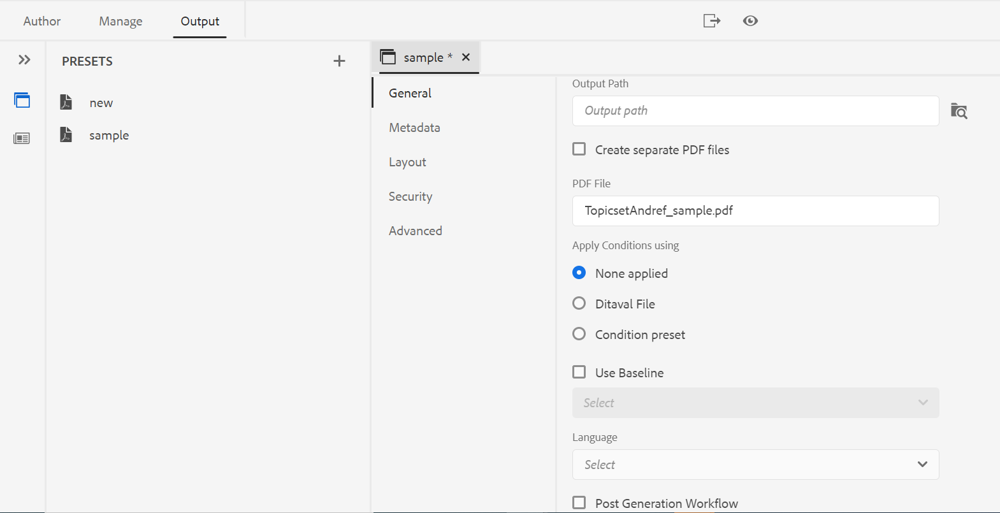
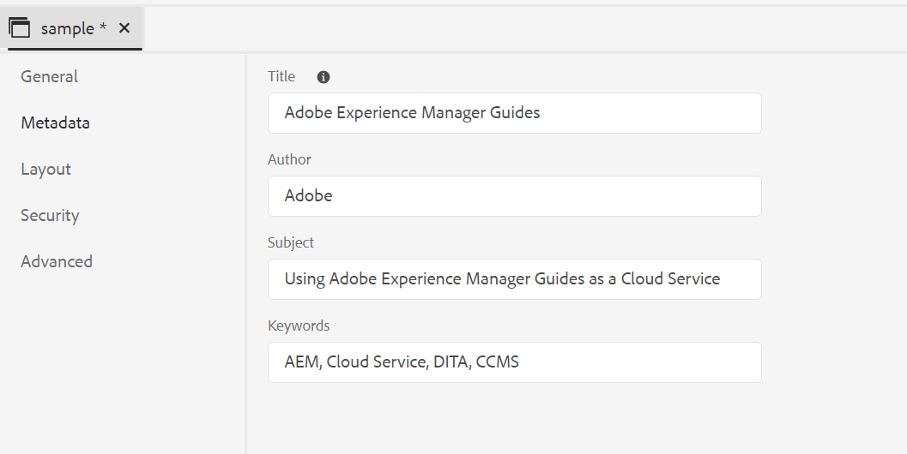

# 發佈PDF輸出

使用AEM指南，您可以產生個別主題的PDF或整個對應檔案。 您可以使用下列三種方法之一，以PDF格式發佈內容：

* **DITA-OT**

使用此方法可從地圖控制面板為地圖產生PDF輸出。 您可以為在地圖控制面板中開啟的地圖建立輸出預設集，以便在產生PDF之前設定發佈屬性。 若要建立或編輯輸出預設集，請 *了解輸出預設集* 區段 [AEM指南as a Cloud Service使用手冊](https://helpx.adobe.com/content/dam/help/en/xml-documentation-solution/cs-apr-22/XML-Documentation-for-Adobe-Experience-Manager_CS_User-Guide_EN.pdf).

有關使用DITA-OT方法產生PDF的詳細資訊，請參閱 [使用DITA-OT產生PDF](https://help.adobe.com/en_US/xml-documentation-for-adobe-experience-manager/index.html#t=DXML-master-map%2Fgenerate-output-pdf.html).

* **FrameMaker Publishing Server(FMPS)**

使用此方法不僅可從DITA內容，而且可以從AEM儲存庫中可用的FrameMaker文檔(.book和.fm)生成PDF輸出。 PDF可透過設定輸出預設集，並使用FrameMaker Publishing Server(FMPS)發佈來建立。 您可以針對PDF和其他格式設計和配置輸出的外觀，並將其儲存在設定檔案(.sts)中。 然後，FMPS將使用此設定檔案生成DITA映射或.book檔案的輸出。 若要建立或編輯輸出預設集，請參閱  *了解輸出預設集* 區段 [AEM指南as a Cloud Service使用手冊](https://helpx.adobe.com/content/dam/help/en/xml-documentation-solution/cs-apr-22/XML-Documentation-for-Adobe-Experience-Manager_CS_User-Guide_EN.pdf).

有關配置FMPS的詳細資訊，請參見 [從FrameMaker文檔生成輸出](https://help.adobe.com/en_US/xml-documentation-for-adobe-experience-manager/index.html#t=DXML-master-map%2Ffm-output-generatation.html).

* **原生PDF發佈**

使用此方法，根據W3C CSS3和CSS分頁媒體標準，產生功能豐富的PDF輸出。 透過原生PDF發佈，您可以使用範本來設定內容的版面和樣式，並套用各種設定來微調您的PDF。 此外，您可以使用範本編輯器修改並建立您自己的範本。

如需原生PDF發佈的詳細資訊，請參閱 [使用原生PDF發佈](#native-pdf-publishing).

## 使用原生PDF發佈 {#native-pdf-publishing}

製作內容時，務必確保內容已針對檢視、編輯和列印進行最佳化。 使用內容樣式的W3C CSS3等標準，以及頁面定義屬性的CSS分頁媒體標準（如大小、邊距、方向、分頁、頁首、頁尾和頁碼），您可以設定PDF檔案的檢視和版面，以確保一致性和可用性。 原生PDF發佈功能使用這些標準來產生PDF。

使用本機PDF發佈，您可以使用預定義的模板來確保內容佈局和結構的一致性、應用樣式表來更改輸出的外觀、優化PDF、設定打印機標籤、允許螢幕閱讀器支援、設定PDF一致性、嵌入字型等。

使用原生PDF發佈產生PDF有兩個方面：

* 使用範本將樣式套用至內容、設定頁面配置和各種設定，以微調您的PDF。 作者可以選擇使用/修改提供的範本範本，或建立自訂範本，並設定發佈者和開發人員使用的進階設定選項。

* 建立或設定PDF輸出預設集以控制PDF設定。 建立PDF輸出預設集後，即可產生PDF。

如需詳細資訊，請參閱 [產生PDF輸出](#generate-pdf-output).

## 建立PDF輸出預設集 {#create-output-preset}

產生PDF輸出的第一步是建立PDF輸出預設集，該預設集是指派給地圖的發佈屬性集合。 您可以為「地圖檢視」面板中開啟的任何地圖建立輸出預設集，或設定現有的預設集，以快速為相同的地圖產生PDF。

從PDF輸出預設集，您可以選取範本、套用條件、設定限制以控制使用者與PDF的互動方式、設定進階設定，例如壓縮、一致性等。

要建立或配置PDF輸出預設集：

1. 在「輸出」(Output)頁簽中，按一下 **預設集** 在左側邊欄。
「預設集」面板隨即開啟。

1. 在輸出中 **預設集** 面板，執行下列操作之一：
   * 連按兩下預先定義的PDF輸出預設集以加以檢視。
   * 針對按一下+圖示 **預設集** 添加新的輸出預設集 **類型：PDF**

1. 配置現有PDF預設集的設定：
   * 按一下  **選項**  表徵圖，然後選擇 **編輯**.
您可以在 **一般**, **中繼資料**, **版面**, **安全性**，和 **進階** 標籤來設定PDF輸出預設集：

**一般**

用於指定基本輸出設定，例如指定輸出路徑、PDF檔案名等。

| 設定 | 說明 |
| --- | --- |
| **輸出路徑** | 儲存PDF輸出的AEM存放庫內的路徑。 請確保輸出路徑未位於項目資料夾內。 若保留為空白，則會在預設DITA映射輸出位置中產生輸出。 您也可以使用下列現成可用的變數來定義輸出路徑。 您可以使用單一或變陣列合來定義此選項。   `${map_filename}`:使用DITA映射檔案名建立目標路徑。   `${map_title}`:使用DITA映射標題建立目標路徑。  `${preset_name}`:使用輸出預設集名稱來建立目標路徑。   `${language_code}`:使用映射檔案所在的語言代碼建立目標路徑。   `${map_parentpath}`:使用映射檔案的完整路徑建立目標路徑。   `${path_after_langfolder}`:使用語言資料夾之後的映射檔案路徑建立目標路徑。 |
| **PDF檔案** | 指定檔案名稱以儲存PDF。 預設情況下，PDF檔案名將添加DITA映射名和預設集名。 例如，ditamap是「TestMap」，預設集的名稱是「preset1」，則pdf的預設名稱將是「TestMap_preset1.pdf」。  您也可以使用下列現成可用的變數來定義PDF檔案。 您可以使用單一或變陣列合來定義此選項。  `${map_filename}` `${map_title}` `${preset_name}`   `${language_code}`。 |
| **使用** | 對於條件化內容，請從以下選項中選擇，以根據這些條件生成PDF輸出：  * **未應用** 如果您不想對地圖和來源內容套用任何條件，請選取此選項。  * **迪塔瓦爾檔案** 選擇DITAVAL檔案以生成條件化內容。 若要選取，請按一下「條件預設集」 ，然後找出檔案。   * **條件預設集** 從下拉式清單中選取條件預設集，以在發佈輸出時套用條件。 如果已添加DITA映射檔案的條件，則此選項可見。 條件設定在DITA映射控制台的「條件預設集」頁簽中可用。 若要深入了解條件預設，請參閱 [使用條件預設集](https://help.adobe.com/en_US/xml-documentation-for-adobe-experience-manager/index.html#t=DXML-master-map%2Fgenerate-output-use-condition-presets.html).   |
| **使用基線** | 如果已為所選DITA映射建立基線，請選擇此選項以指定要發佈的版本。 請參閱 [使用基線](https://help.adobe.com/en_US/xml-documentation-for-adobe-experience-manager/index.html#t=DXML-master-map%2Fgenerate-output-use-baseline-for-publishing.html) 以取得更多詳細資訊。 |
| **建立PDF，並在已發佈版本之間使用變更列** | 使用下列選項，建立PDF，使用變更列顯示兩個版本之間內容的差異：    * **上一版的基線** 選擇要與當前版本或其他基線進行比較的基線版本。 PDF中會出現變更列，指出已修改的內容。 變更列是可視覺識別新內容或修訂內容的垂直線。 變更列會顯示在已插入、變更或刪除的內容左側。   **附註**:如果您選取 **使用基線** 並選擇要發佈的基線，將在兩個選定的基線版本之間進行比較。 例如，如果在 **使用基線**，和1.1版 **上一版的基線**，基線1.1版和基線1.3版之間會進行比較。  * **顯示新增的文字** 選擇以綠色和下划線顯示插入的文本。 預設會選取此選項。   * **顯示已刪除的文本** 選取以紅色顯示已刪除的文字，並加上刪除線。 預設會選取此選項。  **附註** 您也可以使用樣式表自定義更改欄、插入的內容或刪除的內容的樣式。  |
| **產生後的工作流程** | 選取「 」以顯示下拉式清單，其中包含AEM中設定的所有工作流程。 您可以選取在完成PDF產生工作流程後要執行的工作流程。 |

**中繼資料**

中繼資料是內容的說明或定義。 中繼資料有助於內容管理，也有助於搜尋網際網路上的檔案。

使用「中繼資料」索引標籤，設定PDF輸出的標題、作者、主旨和關鍵字。 此元資料映射到輸出PDF「文檔屬性」中「說明」頁簽中的元資料。

**附註**:此元資料會覆寫在書籍層級定義的中繼資料。

| 設定 | 說明 |
|---|---|
| **標題** | 指定簡短且清除的標題以定義文檔。 |
| **作者** | 指定建立文檔的作者的名稱。 |
| **主旨** | 定義與文檔相關的主題或集合。 |
| **關鍵字** | 使用相關關鍵字來改善您的搜尋引擎最佳化(SEO)，並協助使用者尋找您的相關內容。 |

**配置**

用於設定頁面佈局並指定PDF輸出的頁面視圖選項，如「頁面顯示」和設定「縮放」級別。

| 設定 | 說明 |
| --- | --- |
| **PDF範本** | PDF範本提供清楚的結構，可定義頁面配置、內容樣式，以及將各種設定套用至PDF輸出。 從PDF範本下拉式選項中選取，以選擇您偏好的範本。 |
| **頁面顯示** | 使用「頁面顯示」來檢視頁面，以顯示開啟PDF時的顯示方式。 從「頁面顯示」下拉式選項中選取以選擇偏好的檢視。  * **預設**  根據使用者電腦上PDF檢視器的預設設定，顯示為。    * **單頁檢視** 一次顯示一個頁面。     * **單頁捲動** 在連續垂直欄中顯示單一頁面。    * **兩頁檢視** 一次並排顯示兩頁跨頁。.  * **兩頁滾動** 以連續捲動並排顯示兩頁跨頁。 |
| **縮放** | 選取以調整頁面檢視的大小，該頁面檢視在開啟PDF時會如何顯示頁面檢視。   * **預設** 根據用戶電腦上PDF查看器的預設設定顯示為      * **100%** 使頁面以實際大小顯示。       * **調整頁面大小** 使頁面寬度和高度適合在文檔窗格內。.  * **調整頁面寬度** 使頁面寬度填充文檔窗格的寬度。    * **調整頁面高度** 使頁面的高度填充文檔窗格的高度。 |

**安全性**

Protect您的PDF，新增限制以開啟和讀取檔案。 使用以下選項可避免未經授權的訪問。

| 設定 | 說明 |
| --- | --- |
| **設定密碼以開啟文檔** | 選取以新增安全密碼以檢視您的PDF檔案。 在 **用戶密碼** 欄位。 使用者只能輸入此欄位中提供的密碼來開啟PDF。 |
| **設定文檔限制** | 選取以限制使用者與您的PDF互動的方式。 在 **所有者密碼** 欄位，以便使用下列限制設定。   * **打印** 選取以允許使用者列印PDF。   * **印刷品質** 選取以允許使用者以較低解析度列印PDF。    * **內容複製** 選取以允許使用者從PDF複製內容。     * **註解** 選取以允許使用者在PDF中新增附註或註解。    * **內容修改** 選取以允許使用者變更PDF中的內容。    * **協助工具的內容複製** 選取「 」，允許螢幕助讀程式讀取和導覽PDF中的內容。    * **文檔程式集** 選取「 」以允許使用者在PDF中插入頁面。    **附註**:使用者需要輸入擁有者密碼，才能從Adobe Acrobat的「檔案>屬性」變更任何限制。 |

**進階**

使用以下選項指定高級設定以合併PDF、使用壓縮、選擇符合性標準等。

| 設定 | 說明 |
| --- | --- |
| **建立可存取（已標籤）的PDF** | 選取此選項可產生含有標籤的PDF。 標籤的PDF可讓螢幕助讀程式更輕鬆讀取和導覽內容、超連結、書籤等。 例如，如果表被標籤，螢幕助讀程式將知道它正在讀取表，而不只是線條和文本。 |
| **合併目錄中包含的PDF** | 選取此選項，將現有PDF新增至目錄，以將其合併至輸出中。 PDF會插入在目錄中表示的位置，而頁面會隨之增加。 |
| **嵌入使用的字型** | 使用最終用戶電腦上可能未安裝的字型時，選擇此選項。 選擇此選項後，使用的字型將嵌入到PDF中，確保即使字型未安裝在其電腦上，用戶仍可以按預期方式查看PDF。   **附註**:只有字型包含字型供應商允許嵌入的設定，字型才可嵌入。 嵌入字型之前，請確保您擁有所需的設定或許可。 |
| **使用自動連字** | 啟用自動連字後，連字型大小在文法正確的位置中斷行尾的字詞。 |
| **啟用JavaScript** | 如果您有JavaScript程式碼，想要用來在產生PDF之前動態轉換內容，請啟用此選項。 |
| **內嵌多媒體檔案** | 選取此選項，將任何音訊、視訊和任何互動式內容包含在PDF中。 |
| **使用完全壓縮來優化PDF大小** | 如果要壓縮/縮小大型PDF的大小，請選擇此選項。 請記住，壓縮PDF可能會降低檔案質量。 |
| **使用影像壓縮來最佳化PDF大小** | 如果要壓縮/縮小在PDF中使用的影像大小，請選擇此選項。 請記住，壓縮影像可能會降低影像品質。 |
| **使用自訂解析度（每英吋像素）** | 它是以每英吋像素為單位的頁面顯示解析度。 在選取此選項時顯示的欄位中輸入偏好值。 預設值為96像素/英吋。 如果您設定了較低的值，請設定較高的值以符合一英吋內的更多內容，反之亦然。 |
| **顯示浮水印** | 選擇此選項可呈現內容中存在的MathML方程。 否則，方程將被忽略。 |
| **啟用MathML方程** | 選擇此選項可呈現內容中存在的MathML方程。 否則預設會忽略方程。 |
| **PDF符合** | 這是您要儲存PDF的標準，以確保符合標準。 從下拉式清單中選取，以從可用的PDF標準清單中選擇。 如需支援標準的詳細資訊，請參閱 [關於PDF標準](https://helpx.adobe.com/acrobat/using/pdf-conversion-settings.html#about_pdf_x_pdf_e_and_pdf_a_standards). |

## 產生PDF輸出 {#generate-pdf-output}

配置了輸出預設後，可以使用 **產生預設集** 功能。

1. 在 **作者** 頁簽，選擇 **存放庫** 檢視。\
   這會開啟「存放庫」面板。

2. 在存放庫面板中，開啟DITA映射檔案，位於 **地圖檢視**.

3. 在 **輸出** 按一下 **預設集** 來查看「預設」面板。
若要建立或設定輸出預設集，請參閱 [建立PDF輸出預設集](#create-output-preset).
4. 若要儲存您的設定，請按一下 **全部儲存**  圖示（位於「輸出」視圖中的標準工具欄的左上角）。
5. 按一下 **產生預設集**  圖示。
您可以在「輸出預設集」面板中查看所選輸出預設集旁的進度欄。
6. 輸出生成完成後，按一下  **檢視輸出**  圖示來檢視輸出。\
   A **成功** 對話框顯示在螢幕的右下角。
如果輸出失敗，則會顯示以下錯誤訊息。

若要檢視錯誤記錄，請按一下 **解除**，將游標暫留在選取的預設集標籤上，然後按一下  **選項** > **檢視記錄**.
